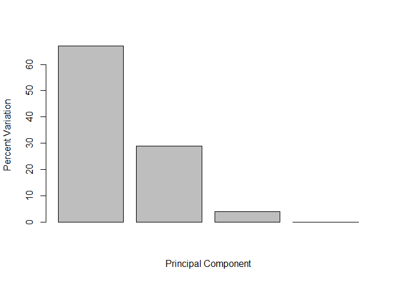

## R Markdown


```r
# Generate some example data for clustering
tmp <- c(rnorm(30,-3), rnorm(30,3))
x <- cbind(x=tmp, y=rev(tmp))
plot(x)
```

<!-- -->


```r
km <- kmeans(x,centers=2,nstart=20)
km
```

```
## K-means clustering with 2 clusters of sizes 30, 30
## 
## Cluster means:
##           x         y
## 1  3.421992 -3.007921
## 2 -3.007921  3.421992
## 
## Clustering vector:
##  [1] 2 2 2 2 2 2 2 2 2 2 2 2 2 2 2 2 2 2 2 2 2 2 2 2 2 2 2 2 2 2 1 1 1 1 1
## [36] 1 1 1 1 1 1 1 1 1 1 1 1 1 1 1 1 1 1 1 1 1 1 1 1 1
## 
## Within cluster sum of squares by cluster:
## [1] 53.62875 53.62875
##  (between_SS / total_SS =  92.0 %)
## 
## Available components:
## 
## [1] "cluster"      "centers"      "totss"        "withinss"    
## [5] "tot.withinss" "betweenss"    "size"         "iter"        
## [9] "ifault"
```

```r
#nstart says how many times to run
```
30 points per each cluster
bunch of components

```r
km$centers
```

```
##           x         y
## 1  3.421992 -3.007921
## 2 -3.007921  3.421992
```


```r
plot(x, col=km$cluster, pch=16)
points(km$centers, col="blue", pch=11)
```

<!-- -->


```r
# First we need to calculate point (dis)similarity
# as the Euclidean distance between observations
dist_matrix <- dist(x)
#convert to matrix to see the structure and dimensions
#View(dist_matrix)
#View(as.matrix(dist_matrix))

dim((as.matrix(dist_matrix)))
```

```
## [1] 60 60
```

```r
# The hclust() function returns a hierarchical
# clustering model
hc <- hclust(d = dist_matrix)
# the print method is not so useful here
hc 
```

```
## 
## Call:
## hclust(d = dist_matrix)
## 
## Cluster method   : complete 
## Distance         : euclidean 
## Number of objects: 60
```


```r
plot(hc)
```

<!-- -->


```r
plot(hc)
abline(h=6, col='red') # baseically draws where you are slicing it up
```

<!-- -->

```r
grps <- cutree(hc, h=6) # cuts on height 6, or could cut at k groups k=2 for ex

table(grps)
```

```
## grps
##  1  2 
## 30 30
```

```r
plot(x,col=grps)
```

<!-- -->


Tries didfferent cutting

```r
plot(x,col=cutree(hc,k=6))
```

<!-- -->


```r
plot(hc)
identify(hc)
```

<!-- -->

only coordinate that matters is height order does not matter 


```r
# Step 1. Generate some example data for clustering
x <- rbind(
 matrix(rnorm(100, mean=0, sd = 0.3), ncol = 2), # c1
 matrix(rnorm(100, mean = 1, sd = 0.3), ncol = 2), # c2
 matrix(c(rnorm(50, mean = 1, sd = 0.3), # c3
 rnorm(50, mean = 0, sd = 0.3)), ncol = 2))
colnames(x) <- c("x", "y")
# Step 2. Plot the data without clustering
plot(x)
```

<!-- -->

```r
# Step 3. Generate colors for known clusters
# (just so we can compare to hclust results)
col <- as.factor( rep(c("c1","c2","c3"), each=50) )
plot(x, col=col)
```

<!-- -->


```r
#use dist hclust plot and cutree fx to return 2 and 3 cluster
yourturndist <- dist(x)
dim(x)
```

```
## [1] 150   2
```

```r
#View(as.matrix(yourturndist))
dim(yourturndist)
```

```
## NULL
```


```r
tiredturn<- hclust(d=yourturndist)
plot(tiredturn)
```

<!-- -->


```r
plot(tiredturn)
abline(h=2.5, col='red') # baseically draws where you are slicing it up
```

<!-- -->

```r
grps <- cutree(hc, k=2) # cuts on height 6, or could cut at k groups k=2 for ex

table(grps)
```

```
## grps
##  1  2 
## 30 30
```


```r
plot(tiredturn)
abline(h=2, col='red') # baseically draws where you are slicing it up
```

<!-- -->

```r
grps <- cutree(hc, k=3) # cuts on height 6, or could cut at k groups k=2 for ex

table(grps)
```

```
## grps
##  1  2  3 
## 30 21  9
```


```r
mydata <-  read.csv("expression.csv", row.names = 1)
dim(mydata)
```

```
## [1] 100  10
```

```r
head(mydata)
```

```
##        wt1 wt2  wt3  wt4 wt5 ko1 ko2 ko3 ko4 ko5
## gene1  439 458  408  429 420  90  88  86  90  93
## gene2  219 200  204  210 187 427 423 434 433 426
## gene3 1006 989 1030 1017 973 252 237 238 226 210
## gene4  783 792  829  856 760 849 856 835 885 894
## gene5  181 249  204  244 225 277 305 272 270 279
## gene6  460 502  491  491 493 612 594 577 618 638
```


```r
#lets do pca
pca <- prcomp(t(mydata), scale = TRUE)

attributes(pca)
```

```
## $names
## [1] "sdev"     "rotation" "center"   "scale"    "x"       
## 
## $class
## [1] "prcomp"
```

```r
#pca
#not useful print fx
```


```r
## A basic PC1 vs PC2 2-D plot
plot(pca$x[,1], pca$x[,2]) 
```

<!-- -->


```r
pca.var <- pca$sdev^2
pca.var.per <- round(pca.var/sum(pca.var)*100,1)
pca.var.per
```

```
##  [1] 92.6  2.3  1.1  1.1  0.8  0.7  0.6  0.4  0.4  0.0
```

this was our cliff after pc1 who really cares generally


```r
barplot(pca.var.per, main="Scree Plot", xlab="Principal component")
```

<!-- -->


```r
## A vector of colors for wt and ko samples
colvec <- as.factor( substr( colnames(mydata), 1, 2) )
plot(pca$x[,1], pca$x[,2], col=colvec, pch=16,
 xlab=paste0("PC1 (", pca.var.per[1], "%)"),
 ylab=paste0("PC2 (", pca.var.per[2], "%)")) 
```

<!-- -->


```r
as.factor(colnames(mydata))
```

```
##  [1] wt1 wt2 wt3 wt4 wt5 ko1 ko2 ko3 ko4 ko5
## Levels: ko1 ko2 ko3 ko4 ko5 wt1 wt2 wt3 wt4 wt5
```

we just want to split string to two characters


```r
substr( colnames(mydata),1,2)
```

```
##  [1] "wt" "wt" "wt" "wt" "wt" "ko" "ko" "ko" "ko" "ko"
```
woohoo
now can do as facoor

```r
as.factor(substr( colnames(mydata),1,2))
```

```
##  [1] wt wt wt wt wt ko ko ko ko ko
## Levels: ko wt
```
so have two levels so can color the wt and ko different

```r
mycols <- as.factor(substr( colnames(mydata),1,2))
plot(pca$x[,1], pca$x[,2], col=mycols, pch=10,
 xlab=paste0("PC1 (", pca.var.per[1], "%)"),
 ylab=paste0("PC2 (", pca.var.per[2], "%)"))
```

<!-- -->


#Your turn UK Food


```r
x <- read.csv("UK_foods.csv")
dim(x)
```

```
## [1] 17  5
```


```r
head(x)
```

```
##                X England Wales Scotland N.Ireland
## 1         Cheese     105   103      103        66
## 2  Carcass_meat      245   227      242       267
## 3    Other_meat      685   803      750       586
## 4           Fish     147   160      122        93
## 5 Fats_and_oils      193   235      184       209
## 6         Sugars     156   175      147       139
```


```r
rownames(x) <- x[,1]
x <- x[,-1]
head(x)
```

```
##                England Wales Scotland N.Ireland
## Cheese             105   103      103        66
## Carcass_meat       245   227      242       267
## Other_meat         685   803      750       586
## Fish               147   160      122        93
## Fats_and_oils      193   235      184       209
## Sugars             156   175      147       139
```


```r
dim(x)
```

```
## [1] 17  4
```


```r
View(x)
```


```r
heatmap(as.matrix(x))
```

<!-- -->

```r
# too laxy to fix the window but the idea is there
```


```r
pca <- prcomp( t(x) )
summary(pca)
```

```
## Importance of components:
##                             PC1      PC2      PC3       PC4
## Standard deviation     324.1502 212.7478 73.87622 4.189e-14
## Proportion of Variance   0.6744   0.2905  0.03503 0.000e+00
## Cumulative Proportion    0.6744   0.9650  1.00000 1.000e+00
```


```r
plot(pca$x[,1], pca$x[,2], xlab="PC1", ylab="PC2", xlim=c(-270,500))
text(pca$x[,1], pca$x[,2], colnames(x))
```

<!-- -->


```r
#gives percent of variance for each pca
v <- round( pca$sdev^2/sum(pca$sdev^2) * 100 )
v
```

```
## [1] 67 29  4  0
```


```r
# gives the cum proportion;;;;
z <- summary(pca)
z$importance
```

```
##                              PC1       PC2      PC3          PC4
## Standard deviation     324.15019 212.74780 73.87622 4.188568e-14
## Proportion of Variance   0.67444   0.29052  0.03503 0.000000e+00
## Cumulative Proportion    0.67444   0.96497  1.00000 1.000000e+00
```


```r
barplot(v, xlab="Principal Component", ylab="Percent Variation")
```

<!-- -->


```r
cumsum(v)
```

```
## [1]  67  96 100 100
```

