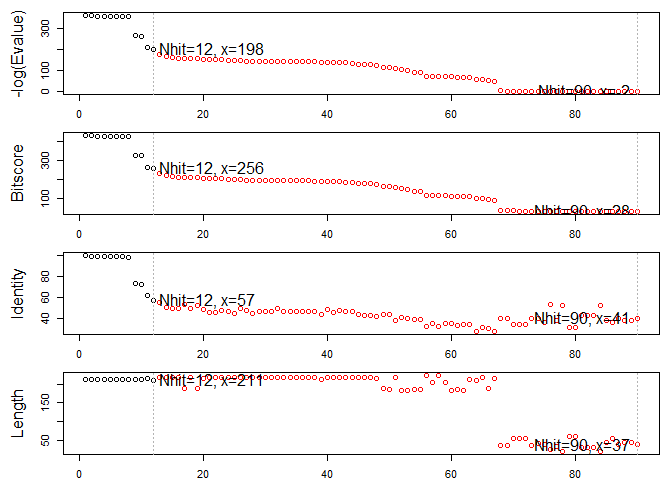
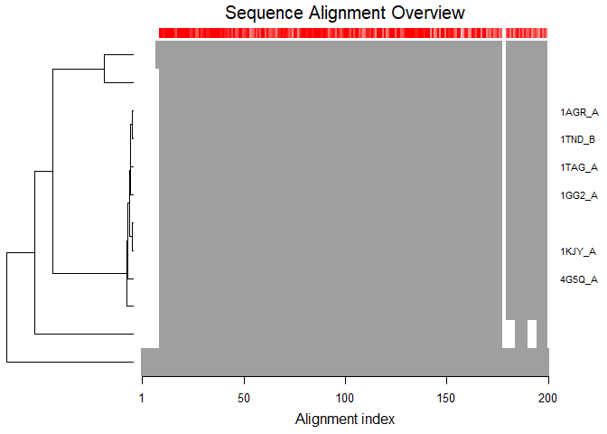
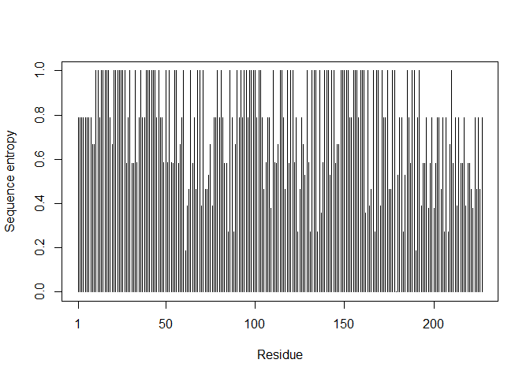
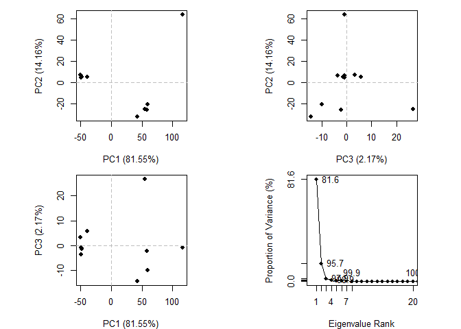

## Section11

https://bioboot.github.io/bimm143_S18/class-material/lecture11-BIMM143_S18.pdf

Q1: What proportion of PDB entries does X-ray crystallography account for? What proportion of
structures are protein?

 125421/140109
[1] 0.8951673

Q2: Type HIV in the search box on the home page and determine how many HIV-1 protease
structures are in the current PDB?

118 Protease structures


oh look it has a csv file

```r
p <- read.csv("Data Export Summary.csv", row.names = 1)
```
now lets get do the math with the csv data

```r
percent <- (p$Total/ sum(p$Total)) * 100
names(percent) <-  row.names(p)
percent
```

```
##               X-Ray                 NMR Electron Microscopy 
##         89.51673340          8.71321614          1.51239392 
##               Other        Multi Method 
##          0.16986775          0.08778879
```

when uploading to github and if you want it to include the rmd in a way where it looks prettier, click the gear icon then go to output options, keep markdown source file. ok. now knit again this will make the .md intermediate folder and then you can go in ahead and commit and push onto git. 


##Using Bio3d

```r
library(bio3d)
```

Read in our  HIV-Pr structure


```r
pdb <- read.pdb("1hsg")
```

```
##   Note: Accessing on-line PDB file
```

```r
pdb
```

```
## 
##  Call:  read.pdb(file = "1hsg")
## 
##    Total Models#: 1
##      Total Atoms#: 1686,  XYZs#: 5058  Chains#: 2  (values: A B)
## 
##      Protein Atoms#: 1514  (residues/Calpha atoms#: 198)
##      Nucleic acid Atoms#: 0  (residues/phosphate atoms#: 0)
## 
##      Non-protein/nucleic Atoms#: 172  (residues: 128)
##      Non-protein/nucleic resid values: [ HOH (127), MK1 (1) ]
## 
##    Protein sequence:
##       PQITLWQRPLVTIKIGGQLKEALLDTGADDTVLEEMSLPGRWKPKMIGGIGGFIKVRQYD
##       QILIEICGHKAIGTVLVGPTPVNIIGRNLLTQIGCTLNFPQITLWQRPLVTIKIGGQLKE
##       ALLDTGADDTVLEEMSLPGRWKPKMIGGIGGFIKVRQYDQILIEICGHKAIGTVLVGPTP
##       VNIIGRNLLTQIGCTLNF
## 
## + attr: atom, xyz, seqres, helix, sheet,
##         calpha, remark, call
```


Q6. How many amino acid residues are there in this pdb object and what are the two nonprotein
residues? 
198


Note that the attributes (+ attr:) of this object are listed on the last couple of lines. To find the
attributes of any such object you can use

```r
attributes(pdb)
```

```
## $names
## [1] "atom"   "xyz"    "seqres" "helix"  "sheet"  "calpha" "remark" "call"  
## 
## $class
## [1] "pdb" "sse"
```

Print a subset of $atom data for the first two atoms


```r
head(pdb$atom)
```

```
##   type eleno elety  alt resid chain resno insert      x      y     z o
## 1 ATOM     1     N <NA>   PRO     A     1   <NA> 29.361 39.686 5.862 1
## 2 ATOM     2    CA <NA>   PRO     A     1   <NA> 30.307 38.663 5.319 1
## 3 ATOM     3     C <NA>   PRO     A     1   <NA> 29.760 38.071 4.022 1
## 4 ATOM     4     O <NA>   PRO     A     1   <NA> 28.600 38.302 3.676 1
## 5 ATOM     5    CB <NA>   PRO     A     1   <NA> 30.508 37.541 6.342 1
## 6 ATOM     6    CG <NA>   PRO     A     1   <NA> 29.296 37.591 7.162 1
##       b segid elesy charge
## 1 38.10  <NA>     N   <NA>
## 2 40.62  <NA>     C   <NA>
## 3 42.64  <NA>     C   <NA>
## 4 43.40  <NA>     O   <NA>
## 5 37.87  <NA>     C   <NA>
## 6 38.40  <NA>     C   <NA>
```
 Note that individual $atom records can also be accessed like this

```r
pdb$atom[1:2, c("eleno","elety", "x","y","z")]
```

```
##   eleno elety      x      y     z
## 1     1     N 29.361 39.686 5.862
## 2     2    CA 30.307 38.663 5.319
```
Which allows us to do the following
J

```r
plot.bio3d(pdb$atom$b[pdb$calpha], sse=pdb, typ="l", ylab="B-factor")
```

<!-- -->


Q7. What type of R object is pdb$atom? HINT: You can always use the str() function to get a
useful summery of any R object.


```r
str(pdb$atom)
```

```
## 'data.frame':	1686 obs. of  16 variables:
##  $ type  : chr  "ATOM" "ATOM" "ATOM" "ATOM" ...
##  $ eleno : int  1 2 3 4 5 6 7 8 9 10 ...
##  $ elety : chr  "N" "CA" "C" "O" ...
##  $ alt   : chr  NA NA NA NA ...
##  $ resid : chr  "PRO" "PRO" "PRO" "PRO" ...
##  $ chain : chr  "A" "A" "A" "A" ...
##  $ resno : int  1 1 1 1 1 1 1 2 2 2 ...
##  $ insert: chr  NA NA NA NA ...
##  $ x     : num  29.4 30.3 29.8 28.6 30.5 ...
##  $ y     : num  39.7 38.7 38.1 38.3 37.5 ...
##  $ z     : num  5.86 5.32 4.02 3.68 6.34 ...
##  $ o     : num  1 1 1 1 1 1 1 1 1 1 ...
##  $ b     : num  38.1 40.6 42.6 43.4 37.9 ...
##  $ segid : chr  NA NA NA NA ...
##  $ elesy : chr  "N" "C" "C" "O" ...
##  $ charge: chr  NA NA NA NA ...
```
It is a data frame

 Print a summary of the coordinate data in $xyz

```r
pdb$xyz
```

```
## 
##    Total Frames#: 1
##    Total XYZs#:   5058,  (Atoms#:  1686)
## 
##     [1]  29.361  39.686  5.862  <...>  30.112  17.912  -4.791  [5058] 
## 
## + attr: Matrix DIM = 1 x 5058
```

Examine row and column dimensions

```r
dim(pdb$xyz)
```

```
## [1]    1 5058
```

Print coordinatesfor the first two atoms

```r
pdb$xyz[1,atom2xyz(1:2)]
```

```
## [1] 29.361 39.686  5.862 30.307 38.663  5.319
```

The Bio3D atom.select() function is arguably one of the most challenging for newcomers to
master. It is however central to PDB structure manipulation and analysis. At its most basic, this
function operates on PDB structure objects (as created by read.pdb()) and returns the
numeric indices of a selected atom subset. These indices can then be used to access the
$atom and $xyz attributes of PDB structure related objects.
For example to select the indices for all C-alpha atoms we can use the following command:


Select all c alpha atoms returnin their indices

```r
ca.inds <- atom.select(pdb,"calpha")
ca.inds 
```

```
## 
##  Call:  atom.select.pdb(pdb = pdb, string = "calpha")
## 
##    Atom Indices#: 198  ($atom)
##    XYZ  Indices#: 594  ($xyz)
## 
## + attr: atom, xyz, call
```

Print details of first few atoms

```r
head(pdb$atom[ca.inds$atom, ])
```

```
##    type eleno elety  alt resid chain resno insert      x      y     z o
## 2  ATOM     2    CA <NA>   PRO     A     1   <NA> 30.307 38.663 5.319 1
## 9  ATOM     9    CA <NA>   GLN     A     2   <NA> 30.158 36.492 2.199 1
## 18 ATOM    18    CA <NA>   ILE     A     3   <NA> 29.123 33.098 3.397 1
## 26 ATOM    26    CA <NA>   THR     A     4   <NA> 29.774 30.143 1.062 1
## 33 ATOM    33    CA <NA>   LEU     A     5   <NA> 27.644 27.003 1.144 1
## 41 ATOM    41    CA <NA>   TRP     A     6   <NA> 30.177 24.150 1.279 1
##        b segid elesy charge
## 2  40.62  <NA>     C   <NA>
## 9  41.30  <NA>     C   <NA>
## 18 34.13  <NA>     C   <NA>
## 26 30.14  <NA>     C   <NA>
## 33 30.12  <NA>     C   <NA>
## 41 30.82  <NA>     C   <NA>
```

and the xyz coordinates

```r
head(pdb$xyz[,ca.inds$xyz])
```

```
## [1] 30.307 38.663  5.319 30.158 36.492  2.199
```


In addition to the common selection strings (such as ‘calpha’ ‘cbeta’ ‘backbone’ ‘protein’
‘notprotein’ ‘ligand’ ‘water’ ‘notwater’ ‘h’ and ‘noh’) various individual atom properties can be
used for selection


select chain a

```r
a.inds <- atom.select(pdb,chain = "A")
```

select c alphas of chain a


```r
ca.inds <- atom.select(pdb,"calpha", chain = "A")
```

combine multiple criteria and return where they intersect


```r
cab.inds <- atom.select(pdb, elety = c("CA","CB"), chain = "A", resno = 10:20)
```
Q8. Use the Bio3D write.pdb() function to write out a new C-alpha atom only PDB file for
viewing in VMD.


```r
inds.ligand <- atom.select(pdb,"ligand")
inds.protein <- atom.select(pdb,"protein")
inds.protein
```

```
## 
##  Call:  atom.select.pdb(pdb = pdb, string = "protein")
## 
##    Atom Indices#: 1514  ($atom)
##    XYZ  Indices#: 4542  ($xyz)
## 
## + attr: atom, xyz, call
```
check we have what we want


```r
#pdb$atom[inds.ligand$atom]
```


```r
#head(pdb$atom[inds.protein$atom])
```


```r
#pdb.protein <- trim.pdb(pbd, inds = inds.protein)
pdb.ligand <- trim.pdb(pdb, inds = inds.ligand)
pdb.ligand
```

```
## 
##  Call:  trim.pdb(pdb = pdb, inds = inds.ligand)
## 
##    Total Models#: 1
##      Total Atoms#: 45,  XYZs#: 135  Chains#: 1  (values: B)
## 
##      Protein Atoms#: 0  (residues/Calpha atoms#: 0)
##      Nucleic acid Atoms#: 0  (residues/phosphate atoms#: 0)
## 
##      Non-protein/nucleic Atoms#: 45  (residues: 1)
##      Non-protein/nucleic resid values: [ MK1 (1) ]
## 
## + attr: atom, helix, sheet, seqres, xyz,
##         calpha, call
```

```r
write.pdb(pdb.ligand,file="1hsvligand.pdb")
```


#Section 5 working with multiple PDB files


Download some example PDB files

```r
ids <- c("1TND_B","1AGR_A","1TAG_A","1GG2_A","1KJY_A","4G5Q_A")
files <- get.pdb(ids, split = TRUE)
```

```
## Warning in get.pdb(ids, split = TRUE): ./1TND.pdb exists. Skipping download
```

```
## Warning in get.pdb(ids, split = TRUE): ./1AGR.pdb exists. Skipping download
```

```
## Warning in get.pdb(ids, split = TRUE): ./1TAG.pdb exists. Skipping download
```

```
## Warning in get.pdb(ids, split = TRUE): ./1GG2.pdb exists. Skipping download
```

```
## Warning in get.pdb(ids, split = TRUE): ./1KJY.pdb exists. Skipping download
```

```
## Warning in get.pdb(ids, split = TRUE): ./4G5Q.pdb exists. Skipping download
```

```
## 
  |                                                                       
  |                                                                 |   0%
  |                                                                       
  |===========                                                      |  17%
  |                                                                       
  |======================                                           |  33%
  |                                                                       
  |================================                                 |  50%
  |                                                                       
  |===========================================                      |  67%
  |                                                                       
  |======================================================           |  83%
  |                                                                       
  |=================================================================| 100%
```


```r
pdbs <- pdbaln(files, fit = TRUE)
```

```
## Reading PDB files:
## ./split_chain/1TND_B.pdb
## ./split_chain/1AGR_A.pdb
## ./split_chain/1TAG_A.pdb
## ./split_chain/1GG2_A.pdb
## ./split_chain/1KJY_A.pdb
## ./split_chain/4G5Q_A.pdb
## .....   PDB has ALT records, taking A only, rm.alt=TRUE
## .
## 
## Extracting sequences
## 
## pdb/seq: 1   name: ./split_chain/1TND_B.pdb 
## pdb/seq: 2   name: ./split_chain/1AGR_A.pdb 
## pdb/seq: 3   name: ./split_chain/1TAG_A.pdb 
## pdb/seq: 4   name: ./split_chain/1GG2_A.pdb 
## pdb/seq: 5   name: ./split_chain/1KJY_A.pdb 
## pdb/seq: 6   name: ./split_chain/4G5Q_A.pdb 
##    PDB has ALT records, taking A only, rm.alt=TRUE
```

Summary


```r
pdbs
```

```
##                                1        .         .         .         .         50 
## [Truncated_Name:1]1TND_B.pdb   --------------------------ARTVKLLLLGAGESGKSTIVKQMK
## [Truncated_Name:2]1AGR_A.pdb   LSAEDKAAVERSKMIDRNLREDGEKAAREVKLLLLGAGESGKSTIVKQMK
## [Truncated_Name:3]1TAG_A.pdb   --------------------------ARTVKLLLLGAGESGKSTIVKQMK
## [Truncated_Name:4]1GG2_A.pdb   LSAEDKAAVERSKMIDRNLREDGEKAAREVKLLLLGAGESGKSTIVKQMK
## [Truncated_Name:5]1KJY_A.pdb   -------------------------GAREVKLLLLGAGESGKSTIVKQMK
## [Truncated_Name:6]4G5Q_A.pdb   --------------------------AREVKLLLLGAGESGKSTIVKQMK
##                                                          ** ********************* 
##                                1        .         .         .         .         50 
## 
##                               51        .         .         .         .         100 
## [Truncated_Name:1]1TND_B.pdb   IIHQDGYSLEECLEFIAIIYGNTLQSILAIVRAMTTLNIQYGDSARQDDA
## [Truncated_Name:2]1AGR_A.pdb   IIHEAGYSEEECKQYKAVVYSNTIQSIIAIIRAMGRLKIDFGDAARADDA
## [Truncated_Name:3]1TAG_A.pdb   IIHQDGYSLEECLEFIAIIYGNTLQSILAIVRAMTTLNIQYGDSARQDDA
## [Truncated_Name:4]1GG2_A.pdb   IIHEAGYSEEECKQYKAVVYSNTIQSIIAIIRAMGRLKIDFGDAARADDA
## [Truncated_Name:5]1KJY_A.pdb   IIHEAGYSEEECKQYKAVVYSNTIQSIIAIIRAMGRLKIDFGDSARADDA
## [Truncated_Name:6]4G5Q_A.pdb   IIHEAGYSEEECKQYKAVVYSNTIQSIIAIIRAMGRLKIDFGDSARADDA
##                                ***  *** ***  ^ *^^* **^***^**^***  * * ^** ** *** 
##                               51        .         .         .         .         100 
## 
##                              101        .         .         .         .         150 
## [Truncated_Name:1]1TND_B.pdb   RKLMHMADTIEEGTMPKEMSDIIQRLWKDSGIQACFDRASEYQLNDSAGY
## [Truncated_Name:2]1AGR_A.pdb   RQLFVLAGAAEEGFMTAELAGVIKRLWKDSGVQACFNRSREYQLNDSAAY
## [Truncated_Name:3]1TAG_A.pdb   RKLMHMADTIEEGTMPKEMSDIIQRLWKDSGIQACFDRASEYQLNDSAGY
## [Truncated_Name:4]1GG2_A.pdb   RQLFVLAGAAEEGFMTAELAGVIKRLWKDSGVQACFNRSREYQLNDSAAY
## [Truncated_Name:5]1KJY_A.pdb   RQLFVLAGAAEEGFMTAELAGVIKRLWKDSGVQACFNRSREYQLNDSAAY
## [Truncated_Name:6]4G5Q_A.pdb   RQLFVLAGAAEEGFMTAELAGVIKRLWKDSGVQACFNRSREYQLNDSAAY
##                                * *  ^*   *** *  *^  ^* *******^**** *  ********^* 
##                              101        .         .         .         .         150 
## 
##                              151        .         .         .         .         200 
## [Truncated_Name:1]1TND_B.pdb   YLSDLERLVTPGYVPTEQDVLRSRVKTTGIIETQFSFKDLNFRMFDVGGQ
## [Truncated_Name:2]1AGR_A.pdb   YLNDLDRIAQPNYIPTQQDVLRTRVKTTGIVETHFTFKDLHFKMFDVGGQ
## [Truncated_Name:3]1TAG_A.pdb   YLSDLERLVTPGYVPTEQDVLRSRVKTTGIIETQFSFKDLNFRMFDVGGQ
## [Truncated_Name:4]1GG2_A.pdb   YLNDLDRIAQPNYIPTQQDVLRTRVKTTGIVETHFTFKDLHFKMFDVGAQ
## [Truncated_Name:5]1KJY_A.pdb   YLNDLDRIAQPNYIPTQQDVLRTRVKTTGIVETHFTFKDLHFKMFDVGGQ
## [Truncated_Name:6]4G5Q_A.pdb   YLNDLDRIAQPNYIPTQQDVLRTRVKTTGIVETHFTFKDLHFKMFDVGGQ
##                                ** **^*^  * *^** *****^*******^** *^**** *^*****^* 
##                              151        .         .         .         .         200 
## 
##                              201        .         .         .         .         250 
## [Truncated_Name:1]1TND_B.pdb   RSERKKWIHCFEGVTCIIFIAALSAYDMVLVEDDEVNRMHESLHLFNSIC
## [Truncated_Name:2]1AGR_A.pdb   RSERKKWIHCFEGVTAIIFCVALSDYDLVLAEDEEMNRMHESMKLFDSIC
## [Truncated_Name:3]1TAG_A.pdb   RSERKKWIHCFEGVTCIIFIAALSAYDMVLVEDDEVNRMHESLHLFNSIC
## [Truncated_Name:4]1GG2_A.pdb   RSERKKWIHCFEGVTAIIFCVALSDYDLVLAEDEEMNRMHESMKLFDSIC
## [Truncated_Name:5]1KJY_A.pdb   RSERKKWIHCFEGVTAIIFCVALSDYDLVLAEDEEMNRMHESMKLFDSIC
## [Truncated_Name:6]4G5Q_A.pdb   RSERKKWIHCFEGVTAIIFCVALSDYDLVLAEDEEMNRMHESMKLFDSIC
##                                *************** ***  *** **^** **^*^******^^** *** 
##                              201        .         .         .         .         250 
## 
##                              251        .         .         .         .         300 
## [Truncated_Name:1]1TND_B.pdb   NHRYFATTSIVLFLNKKDVFSEKIKKAHLSICFPDYNGPNTYEDAGNYIK
## [Truncated_Name:2]1AGR_A.pdb   NNKWFTDTSIILFLNKKDLFEEKIKKSPLTICYPEYAGSNTYEEAAAYIQ
## [Truncated_Name:3]1TAG_A.pdb   NHRYFATTSIVLFLNKKDVFSEKIKKAHLSICFPDYNGPNTYEDAGNYIK
## [Truncated_Name:4]1GG2_A.pdb   NNKWFTDTSIILFLNKKDLFEEKIKKSPLTICYPEYAGSNTYEEAAAYIQ
## [Truncated_Name:5]1KJY_A.pdb   NNKWFTDTSIILFLNKKDLFEEKIKKSPLTICYPEYAGSNTYEEAAAYIQ
## [Truncated_Name:6]4G5Q_A.pdb   NNKWFTDTSIILFLNKKDLFEEKIKKSPLTICYPEYAGSNTYEEAAAYIQ
##                                * ^^*  ***^*******^* *****  *^**^*^* * ****^*^ **  
##                              251        .         .         .         .         300 
## 
##                              301        .         .         .         .         350 
## [Truncated_Name:1]1TND_B.pdb   VQFLELNMRRDVKEIYSHMTCATDTQNVKFVFDAVTDIIIKE--------
## [Truncated_Name:2]1AGR_A.pdb   CQFEDLNKRKDTKEIYTHFTCATDTKNVQFVFDAVTDVIIKNNLKDCGLF
## [Truncated_Name:3]1TAG_A.pdb   VQFLELNMRRDVKEIYSHMTCATDTQNVKFVFDAVTDIII----------
## [Truncated_Name:4]1GG2_A.pdb   CQFEDLNKRKDTKEIYTHFTCATDTKNVQFVFDAVTDVIIKNNL------
## [Truncated_Name:5]1KJY_A.pdb   CQFEDLNKRKDTKEIYTHFTCATDTKNVQFVFDAVTDVIIKNNLK-----
## [Truncated_Name:6]4G5Q_A.pdb   CQFEDLNKRKDTKEIYTHFTCATDTKNVQFVFDAVTDVIIKNNLKD----
##                                 ** ^** *^* ****^* ****** ** ********^**           
##                              301        .         .         .         .         350 
## 
## Call:
##   pdbaln(files = files, fit = TRUE)
## 
## Class:
##   pdbs, fasta
## 
## Alignment dimensions:
##   6 sequence rows; 350 position columns (314 non-gap, 36 gap) 
## 
## + attr: xyz, resno, b, chain, id, ali, resid, sse, call
```

Here the returned object is of class pdbs. Note that it contains a xyz numeric matrix of aligned
C-alpha coordinates, a ali matrix of aligned residues, and a resno matrix of aligned residue
numbers (see the list of associated attributes (+ attr)). These attirbutes can be accessed
using the common $ syntax in R. E.g. use pdbs$ali to access the alignment. To access the
first few rows of the alignment matrix we use standard subsetting syntax for matrices in R:

access first 5 rows and 8 columns

```r
pdbs$ali[1:5, 1:8]
```

```
##                          [,1] [,2] [,3] [,4] [,5] [,6] [,7] [,8]
## ./split_chain/1TND_B.pdb "-"  "-"  "-"  "-"  "-"  "-"  "-"  "-" 
## ./split_chain/1AGR_A.pdb "L"  "S"  "A"  "E"  "D"  "K"  "A"  "A" 
## ./split_chain/1TAG_A.pdb "-"  "-"  "-"  "-"  "-"  "-"  "-"  "-" 
## ./split_chain/1GG2_A.pdb "L"  "S"  "A"  "E"  "D"  "K"  "A"  "A" 
## ./split_chain/1KJY_A.pdb "-"  "-"  "-"  "-"  "-"  "-"  "-"  "-"
```

Associated residues numbers


```r
pdbs$resno[1:5, 1:8]
```

```
##                          [,1] [,2] [,3] [,4] [,5] [,6] [,7] [,8]
## ./split_chain/1TND_B.pdb   NA   NA   NA   NA   NA   NA   NA   NA
## ./split_chain/1AGR_A.pdb    5    6    7    8    9   10   11   12
## ./split_chain/1TAG_A.pdb   NA   NA   NA   NA   NA   NA   NA   NA
## ./split_chain/1GG2_A.pdb    5    6    7    8    9   10   11   12
## ./split_chain/1KJY_A.pdb   NA   NA   NA   NA   NA   NA   NA   NA
```

inspect alignment for gaps

```r
gaps <- gap.inspect(pdbs$ali)
```
indices of non gap columns

```r
head(gaps$f.inds)
```

```
## [1] 27 28 29 30 31 32
```

access non gap columns

```r
pdbs$ali[,gaps$f.inds]
```

```
##                          [,1] [,2] [,3] [,4] [,5] [,6] [,7] [,8] [,9]
## ./split_chain/1TND_B.pdb "A"  "R"  "T"  "V"  "K"  "L"  "L"  "L"  "L" 
## ./split_chain/1AGR_A.pdb "A"  "R"  "E"  "V"  "K"  "L"  "L"  "L"  "L" 
## ./split_chain/1TAG_A.pdb "A"  "R"  "T"  "V"  "K"  "L"  "L"  "L"  "L" 
## ./split_chain/1GG2_A.pdb "A"  "R"  "E"  "V"  "K"  "L"  "L"  "L"  "L" 
## ./split_chain/1KJY_A.pdb "A"  "R"  "E"  "V"  "K"  "L"  "L"  "L"  "L" 
## ./split_chain/4G5Q_A.pdb "A"  "R"  "E"  "V"  "K"  "L"  "L"  "L"  "L" 
##                          [,10] [,11] [,12] [,13] [,14] [,15] [,16] [,17]
## ./split_chain/1TND_B.pdb "G"   "A"   "G"   "E"   "S"   "G"   "K"   "S"  
## ./split_chain/1AGR_A.pdb "G"   "A"   "G"   "E"   "S"   "G"   "K"   "S"  
## ./split_chain/1TAG_A.pdb "G"   "A"   "G"   "E"   "S"   "G"   "K"   "S"  
## ./split_chain/1GG2_A.pdb "G"   "A"   "G"   "E"   "S"   "G"   "K"   "S"  
## ./split_chain/1KJY_A.pdb "G"   "A"   "G"   "E"   "S"   "G"   "K"   "S"  
## ./split_chain/4G5Q_A.pdb "G"   "A"   "G"   "E"   "S"   "G"   "K"   "S"  
##                          [,18] [,19] [,20] [,21] [,22] [,23] [,24] [,25]
## ./split_chain/1TND_B.pdb "T"   "I"   "V"   "K"   "Q"   "M"   "K"   "I"  
## ./split_chain/1AGR_A.pdb "T"   "I"   "V"   "K"   "Q"   "M"   "K"   "I"  
## ./split_chain/1TAG_A.pdb "T"   "I"   "V"   "K"   "Q"   "M"   "K"   "I"  
## ./split_chain/1GG2_A.pdb "T"   "I"   "V"   "K"   "Q"   "M"   "K"   "I"  
## ./split_chain/1KJY_A.pdb "T"   "I"   "V"   "K"   "Q"   "M"   "K"   "I"  
## ./split_chain/4G5Q_A.pdb "T"   "I"   "V"   "K"   "Q"   "M"   "K"   "I"  
##                          [,26] [,27] [,28] [,29] [,30] [,31] [,32] [,33]
## ./split_chain/1TND_B.pdb "I"   "H"   "Q"   "D"   "G"   "Y"   "S"   "L"  
## ./split_chain/1AGR_A.pdb "I"   "H"   "E"   "A"   "G"   "Y"   "S"   "E"  
## ./split_chain/1TAG_A.pdb "I"   "H"   "Q"   "D"   "G"   "Y"   "S"   "L"  
## ./split_chain/1GG2_A.pdb "I"   "H"   "E"   "A"   "G"   "Y"   "S"   "E"  
## ./split_chain/1KJY_A.pdb "I"   "H"   "E"   "A"   "G"   "Y"   "S"   "E"  
## ./split_chain/4G5Q_A.pdb "I"   "H"   "E"   "A"   "G"   "Y"   "S"   "E"  
##                          [,34] [,35] [,36] [,37] [,38] [,39] [,40] [,41]
## ./split_chain/1TND_B.pdb "E"   "E"   "C"   "L"   "E"   "F"   "I"   "A"  
## ./split_chain/1AGR_A.pdb "E"   "E"   "C"   "K"   "Q"   "Y"   "K"   "A"  
## ./split_chain/1TAG_A.pdb "E"   "E"   "C"   "L"   "E"   "F"   "I"   "A"  
## ./split_chain/1GG2_A.pdb "E"   "E"   "C"   "K"   "Q"   "Y"   "K"   "A"  
## ./split_chain/1KJY_A.pdb "E"   "E"   "C"   "K"   "Q"   "Y"   "K"   "A"  
## ./split_chain/4G5Q_A.pdb "E"   "E"   "C"   "K"   "Q"   "Y"   "K"   "A"  
##                          [,42] [,43] [,44] [,45] [,46] [,47] [,48] [,49]
## ./split_chain/1TND_B.pdb "I"   "I"   "Y"   "G"   "N"   "T"   "L"   "Q"  
## ./split_chain/1AGR_A.pdb "V"   "V"   "Y"   "S"   "N"   "T"   "I"   "Q"  
## ./split_chain/1TAG_A.pdb "I"   "I"   "Y"   "G"   "N"   "T"   "L"   "Q"  
## ./split_chain/1GG2_A.pdb "V"   "V"   "Y"   "S"   "N"   "T"   "I"   "Q"  
## ./split_chain/1KJY_A.pdb "V"   "V"   "Y"   "S"   "N"   "T"   "I"   "Q"  
## ./split_chain/4G5Q_A.pdb "V"   "V"   "Y"   "S"   "N"   "T"   "I"   "Q"  
##                          [,50] [,51] [,52] [,53] [,54] [,55] [,56] [,57]
## ./split_chain/1TND_B.pdb "S"   "I"   "L"   "A"   "I"   "V"   "R"   "A"  
## ./split_chain/1AGR_A.pdb "S"   "I"   "I"   "A"   "I"   "I"   "R"   "A"  
## ./split_chain/1TAG_A.pdb "S"   "I"   "L"   "A"   "I"   "V"   "R"   "A"  
## ./split_chain/1GG2_A.pdb "S"   "I"   "I"   "A"   "I"   "I"   "R"   "A"  
## ./split_chain/1KJY_A.pdb "S"   "I"   "I"   "A"   "I"   "I"   "R"   "A"  
## ./split_chain/4G5Q_A.pdb "S"   "I"   "I"   "A"   "I"   "I"   "R"   "A"  
##                          [,58] [,59] [,60] [,61] [,62] [,63] [,64] [,65]
## ./split_chain/1TND_B.pdb "M"   "T"   "T"   "L"   "N"   "I"   "Q"   "Y"  
## ./split_chain/1AGR_A.pdb "M"   "G"   "R"   "L"   "K"   "I"   "D"   "F"  
## ./split_chain/1TAG_A.pdb "M"   "T"   "T"   "L"   "N"   "I"   "Q"   "Y"  
## ./split_chain/1GG2_A.pdb "M"   "G"   "R"   "L"   "K"   "I"   "D"   "F"  
## ./split_chain/1KJY_A.pdb "M"   "G"   "R"   "L"   "K"   "I"   "D"   "F"  
## ./split_chain/4G5Q_A.pdb "M"   "G"   "R"   "L"   "K"   "I"   "D"   "F"  
##                          [,66] [,67] [,68] [,69] [,70] [,71] [,72] [,73]
## ./split_chain/1TND_B.pdb "G"   "D"   "S"   "A"   "R"   "Q"   "D"   "D"  
## ./split_chain/1AGR_A.pdb "G"   "D"   "A"   "A"   "R"   "A"   "D"   "D"  
## ./split_chain/1TAG_A.pdb "G"   "D"   "S"   "A"   "R"   "Q"   "D"   "D"  
## ./split_chain/1GG2_A.pdb "G"   "D"   "A"   "A"   "R"   "A"   "D"   "D"  
## ./split_chain/1KJY_A.pdb "G"   "D"   "S"   "A"   "R"   "A"   "D"   "D"  
## ./split_chain/4G5Q_A.pdb "G"   "D"   "S"   "A"   "R"   "A"   "D"   "D"  
##                          [,74] [,75] [,76] [,77] [,78] [,79] [,80] [,81]
## ./split_chain/1TND_B.pdb "A"   "R"   "K"   "L"   "M"   "H"   "M"   "A"  
## ./split_chain/1AGR_A.pdb "A"   "R"   "Q"   "L"   "F"   "V"   "L"   "A"  
## ./split_chain/1TAG_A.pdb "A"   "R"   "K"   "L"   "M"   "H"   "M"   "A"  
## ./split_chain/1GG2_A.pdb "A"   "R"   "Q"   "L"   "F"   "V"   "L"   "A"  
## ./split_chain/1KJY_A.pdb "A"   "R"   "Q"   "L"   "F"   "V"   "L"   "A"  
## ./split_chain/4G5Q_A.pdb "A"   "R"   "Q"   "L"   "F"   "V"   "L"   "A"  
##                          [,82] [,83] [,84] [,85] [,86] [,87] [,88] [,89]
## ./split_chain/1TND_B.pdb "D"   "T"   "I"   "E"   "E"   "G"   "T"   "M"  
## ./split_chain/1AGR_A.pdb "G"   "A"   "A"   "E"   "E"   "G"   "F"   "M"  
## ./split_chain/1TAG_A.pdb "D"   "T"   "I"   "E"   "E"   "G"   "T"   "M"  
## ./split_chain/1GG2_A.pdb "G"   "A"   "A"   "E"   "E"   "G"   "F"   "M"  
## ./split_chain/1KJY_A.pdb "G"   "A"   "A"   "E"   "E"   "G"   "F"   "M"  
## ./split_chain/4G5Q_A.pdb "G"   "A"   "A"   "E"   "E"   "G"   "F"   "M"  
##                          [,90] [,91] [,92] [,93] [,94] [,95] [,96] [,97]
## ./split_chain/1TND_B.pdb "P"   "K"   "E"   "M"   "S"   "D"   "I"   "I"  
## ./split_chain/1AGR_A.pdb "T"   "A"   "E"   "L"   "A"   "G"   "V"   "I"  
## ./split_chain/1TAG_A.pdb "P"   "K"   "E"   "M"   "S"   "D"   "I"   "I"  
## ./split_chain/1GG2_A.pdb "T"   "A"   "E"   "L"   "A"   "G"   "V"   "I"  
## ./split_chain/1KJY_A.pdb "T"   "A"   "E"   "L"   "A"   "G"   "V"   "I"  
## ./split_chain/4G5Q_A.pdb "T"   "A"   "E"   "L"   "A"   "G"   "V"   "I"  
##                          [,98] [,99] [,100] [,101] [,102] [,103] [,104]
## ./split_chain/1TND_B.pdb "Q"   "R"   "L"    "W"    "K"    "D"    "S"   
## ./split_chain/1AGR_A.pdb "K"   "R"   "L"    "W"    "K"    "D"    "S"   
## ./split_chain/1TAG_A.pdb "Q"   "R"   "L"    "W"    "K"    "D"    "S"   
## ./split_chain/1GG2_A.pdb "K"   "R"   "L"    "W"    "K"    "D"    "S"   
## ./split_chain/1KJY_A.pdb "K"   "R"   "L"    "W"    "K"    "D"    "S"   
## ./split_chain/4G5Q_A.pdb "K"   "R"   "L"    "W"    "K"    "D"    "S"   
##                          [,105] [,106] [,107] [,108] [,109] [,110] [,111]
## ./split_chain/1TND_B.pdb "G"    "I"    "Q"    "A"    "C"    "F"    "D"   
## ./split_chain/1AGR_A.pdb "G"    "V"    "Q"    "A"    "C"    "F"    "N"   
## ./split_chain/1TAG_A.pdb "G"    "I"    "Q"    "A"    "C"    "F"    "D"   
## ./split_chain/1GG2_A.pdb "G"    "V"    "Q"    "A"    "C"    "F"    "N"   
## ./split_chain/1KJY_A.pdb "G"    "V"    "Q"    "A"    "C"    "F"    "N"   
## ./split_chain/4G5Q_A.pdb "G"    "V"    "Q"    "A"    "C"    "F"    "N"   
##                          [,112] [,113] [,114] [,115] [,116] [,117] [,118]
## ./split_chain/1TND_B.pdb "R"    "A"    "S"    "E"    "Y"    "Q"    "L"   
## ./split_chain/1AGR_A.pdb "R"    "S"    "R"    "E"    "Y"    "Q"    "L"   
## ./split_chain/1TAG_A.pdb "R"    "A"    "S"    "E"    "Y"    "Q"    "L"   
## ./split_chain/1GG2_A.pdb "R"    "S"    "R"    "E"    "Y"    "Q"    "L"   
## ./split_chain/1KJY_A.pdb "R"    "S"    "R"    "E"    "Y"    "Q"    "L"   
## ./split_chain/4G5Q_A.pdb "R"    "S"    "R"    "E"    "Y"    "Q"    "L"   
##                          [,119] [,120] [,121] [,122] [,123] [,124] [,125]
## ./split_chain/1TND_B.pdb "N"    "D"    "S"    "A"    "G"    "Y"    "Y"   
## ./split_chain/1AGR_A.pdb "N"    "D"    "S"    "A"    "A"    "Y"    "Y"   
## ./split_chain/1TAG_A.pdb "N"    "D"    "S"    "A"    "G"    "Y"    "Y"   
## ./split_chain/1GG2_A.pdb "N"    "D"    "S"    "A"    "A"    "Y"    "Y"   
## ./split_chain/1KJY_A.pdb "N"    "D"    "S"    "A"    "A"    "Y"    "Y"   
## ./split_chain/4G5Q_A.pdb "N"    "D"    "S"    "A"    "A"    "Y"    "Y"   
##                          [,126] [,127] [,128] [,129] [,130] [,131] [,132]
## ./split_chain/1TND_B.pdb "L"    "S"    "D"    "L"    "E"    "R"    "L"   
## ./split_chain/1AGR_A.pdb "L"    "N"    "D"    "L"    "D"    "R"    "I"   
## ./split_chain/1TAG_A.pdb "L"    "S"    "D"    "L"    "E"    "R"    "L"   
## ./split_chain/1GG2_A.pdb "L"    "N"    "D"    "L"    "D"    "R"    "I"   
## ./split_chain/1KJY_A.pdb "L"    "N"    "D"    "L"    "D"    "R"    "I"   
## ./split_chain/4G5Q_A.pdb "L"    "N"    "D"    "L"    "D"    "R"    "I"   
##                          [,133] [,134] [,135] [,136] [,137] [,138] [,139]
## ./split_chain/1TND_B.pdb "V"    "T"    "P"    "G"    "Y"    "V"    "P"   
## ./split_chain/1AGR_A.pdb "A"    "Q"    "P"    "N"    "Y"    "I"    "P"   
## ./split_chain/1TAG_A.pdb "V"    "T"    "P"    "G"    "Y"    "V"    "P"   
## ./split_chain/1GG2_A.pdb "A"    "Q"    "P"    "N"    "Y"    "I"    "P"   
## ./split_chain/1KJY_A.pdb "A"    "Q"    "P"    "N"    "Y"    "I"    "P"   
## ./split_chain/4G5Q_A.pdb "A"    "Q"    "P"    "N"    "Y"    "I"    "P"   
##                          [,140] [,141] [,142] [,143] [,144] [,145] [,146]
## ./split_chain/1TND_B.pdb "T"    "E"    "Q"    "D"    "V"    "L"    "R"   
## ./split_chain/1AGR_A.pdb "T"    "Q"    "Q"    "D"    "V"    "L"    "R"   
## ./split_chain/1TAG_A.pdb "T"    "E"    "Q"    "D"    "V"    "L"    "R"   
## ./split_chain/1GG2_A.pdb "T"    "Q"    "Q"    "D"    "V"    "L"    "R"   
## ./split_chain/1KJY_A.pdb "T"    "Q"    "Q"    "D"    "V"    "L"    "R"   
## ./split_chain/4G5Q_A.pdb "T"    "Q"    "Q"    "D"    "V"    "L"    "R"   
##                          [,147] [,148] [,149] [,150] [,151] [,152] [,153]
## ./split_chain/1TND_B.pdb "S"    "R"    "V"    "K"    "T"    "T"    "G"   
## ./split_chain/1AGR_A.pdb "T"    "R"    "V"    "K"    "T"    "T"    "G"   
## ./split_chain/1TAG_A.pdb "S"    "R"    "V"    "K"    "T"    "T"    "G"   
## ./split_chain/1GG2_A.pdb "T"    "R"    "V"    "K"    "T"    "T"    "G"   
## ./split_chain/1KJY_A.pdb "T"    "R"    "V"    "K"    "T"    "T"    "G"   
## ./split_chain/4G5Q_A.pdb "T"    "R"    "V"    "K"    "T"    "T"    "G"   
##                          [,154] [,155] [,156] [,157] [,158] [,159] [,160]
## ./split_chain/1TND_B.pdb "I"    "I"    "E"    "T"    "Q"    "F"    "S"   
## ./split_chain/1AGR_A.pdb "I"    "V"    "E"    "T"    "H"    "F"    "T"   
## ./split_chain/1TAG_A.pdb "I"    "I"    "E"    "T"    "Q"    "F"    "S"   
## ./split_chain/1GG2_A.pdb "I"    "V"    "E"    "T"    "H"    "F"    "T"   
## ./split_chain/1KJY_A.pdb "I"    "V"    "E"    "T"    "H"    "F"    "T"   
## ./split_chain/4G5Q_A.pdb "I"    "V"    "E"    "T"    "H"    "F"    "T"   
##                          [,161] [,162] [,163] [,164] [,165] [,166] [,167]
## ./split_chain/1TND_B.pdb "F"    "K"    "D"    "L"    "N"    "F"    "R"   
## ./split_chain/1AGR_A.pdb "F"    "K"    "D"    "L"    "H"    "F"    "K"   
## ./split_chain/1TAG_A.pdb "F"    "K"    "D"    "L"    "N"    "F"    "R"   
## ./split_chain/1GG2_A.pdb "F"    "K"    "D"    "L"    "H"    "F"    "K"   
## ./split_chain/1KJY_A.pdb "F"    "K"    "D"    "L"    "H"    "F"    "K"   
## ./split_chain/4G5Q_A.pdb "F"    "K"    "D"    "L"    "H"    "F"    "K"   
##                          [,168] [,169] [,170] [,171] [,172] [,173] [,174]
## ./split_chain/1TND_B.pdb "M"    "F"    "D"    "V"    "G"    "G"    "Q"   
## ./split_chain/1AGR_A.pdb "M"    "F"    "D"    "V"    "G"    "G"    "Q"   
## ./split_chain/1TAG_A.pdb "M"    "F"    "D"    "V"    "G"    "G"    "Q"   
## ./split_chain/1GG2_A.pdb "M"    "F"    "D"    "V"    "G"    "A"    "Q"   
## ./split_chain/1KJY_A.pdb "M"    "F"    "D"    "V"    "G"    "G"    "Q"   
## ./split_chain/4G5Q_A.pdb "M"    "F"    "D"    "V"    "G"    "G"    "Q"   
##                          [,175] [,176] [,177] [,178] [,179] [,180] [,181]
## ./split_chain/1TND_B.pdb "R"    "S"    "E"    "R"    "K"    "K"    "W"   
## ./split_chain/1AGR_A.pdb "R"    "S"    "E"    "R"    "K"    "K"    "W"   
## ./split_chain/1TAG_A.pdb "R"    "S"    "E"    "R"    "K"    "K"    "W"   
## ./split_chain/1GG2_A.pdb "R"    "S"    "E"    "R"    "K"    "K"    "W"   
## ./split_chain/1KJY_A.pdb "R"    "S"    "E"    "R"    "K"    "K"    "W"   
## ./split_chain/4G5Q_A.pdb "R"    "S"    "E"    "R"    "K"    "K"    "W"   
##                          [,182] [,183] [,184] [,185] [,186] [,187] [,188]
## ./split_chain/1TND_B.pdb "I"    "H"    "C"    "F"    "E"    "G"    "V"   
## ./split_chain/1AGR_A.pdb "I"    "H"    "C"    "F"    "E"    "G"    "V"   
## ./split_chain/1TAG_A.pdb "I"    "H"    "C"    "F"    "E"    "G"    "V"   
## ./split_chain/1GG2_A.pdb "I"    "H"    "C"    "F"    "E"    "G"    "V"   
## ./split_chain/1KJY_A.pdb "I"    "H"    "C"    "F"    "E"    "G"    "V"   
## ./split_chain/4G5Q_A.pdb "I"    "H"    "C"    "F"    "E"    "G"    "V"   
##                          [,189] [,190] [,191] [,192] [,193] [,194] [,195]
## ./split_chain/1TND_B.pdb "T"    "C"    "I"    "I"    "F"    "I"    "A"   
## ./split_chain/1AGR_A.pdb "T"    "A"    "I"    "I"    "F"    "C"    "V"   
## ./split_chain/1TAG_A.pdb "T"    "C"    "I"    "I"    "F"    "I"    "A"   
## ./split_chain/1GG2_A.pdb "T"    "A"    "I"    "I"    "F"    "C"    "V"   
## ./split_chain/1KJY_A.pdb "T"    "A"    "I"    "I"    "F"    "C"    "V"   
## ./split_chain/4G5Q_A.pdb "T"    "A"    "I"    "I"    "F"    "C"    "V"   
##                          [,196] [,197] [,198] [,199] [,200] [,201] [,202]
## ./split_chain/1TND_B.pdb "A"    "L"    "S"    "A"    "Y"    "D"    "M"   
## ./split_chain/1AGR_A.pdb "A"    "L"    "S"    "D"    "Y"    "D"    "L"   
## ./split_chain/1TAG_A.pdb "A"    "L"    "S"    "A"    "Y"    "D"    "M"   
## ./split_chain/1GG2_A.pdb "A"    "L"    "S"    "D"    "Y"    "D"    "L"   
## ./split_chain/1KJY_A.pdb "A"    "L"    "S"    "D"    "Y"    "D"    "L"   
## ./split_chain/4G5Q_A.pdb "A"    "L"    "S"    "D"    "Y"    "D"    "L"   
##                          [,203] [,204] [,205] [,206] [,207] [,208] [,209]
## ./split_chain/1TND_B.pdb "V"    "L"    "V"    "E"    "D"    "D"    "E"   
## ./split_chain/1AGR_A.pdb "V"    "L"    "A"    "E"    "D"    "E"    "E"   
## ./split_chain/1TAG_A.pdb "V"    "L"    "V"    "E"    "D"    "D"    "E"   
## ./split_chain/1GG2_A.pdb "V"    "L"    "A"    "E"    "D"    "E"    "E"   
## ./split_chain/1KJY_A.pdb "V"    "L"    "A"    "E"    "D"    "E"    "E"   
## ./split_chain/4G5Q_A.pdb "V"    "L"    "A"    "E"    "D"    "E"    "E"   
##                          [,210] [,211] [,212] [,213] [,214] [,215] [,216]
## ./split_chain/1TND_B.pdb "V"    "N"    "R"    "M"    "H"    "E"    "S"   
## ./split_chain/1AGR_A.pdb "M"    "N"    "R"    "M"    "H"    "E"    "S"   
## ./split_chain/1TAG_A.pdb "V"    "N"    "R"    "M"    "H"    "E"    "S"   
## ./split_chain/1GG2_A.pdb "M"    "N"    "R"    "M"    "H"    "E"    "S"   
## ./split_chain/1KJY_A.pdb "M"    "N"    "R"    "M"    "H"    "E"    "S"   
## ./split_chain/4G5Q_A.pdb "M"    "N"    "R"    "M"    "H"    "E"    "S"   
##                          [,217] [,218] [,219] [,220] [,221] [,222] [,223]
## ./split_chain/1TND_B.pdb "L"    "H"    "L"    "F"    "N"    "S"    "I"   
## ./split_chain/1AGR_A.pdb "M"    "K"    "L"    "F"    "D"    "S"    "I"   
## ./split_chain/1TAG_A.pdb "L"    "H"    "L"    "F"    "N"    "S"    "I"   
## ./split_chain/1GG2_A.pdb "M"    "K"    "L"    "F"    "D"    "S"    "I"   
## ./split_chain/1KJY_A.pdb "M"    "K"    "L"    "F"    "D"    "S"    "I"   
## ./split_chain/4G5Q_A.pdb "M"    "K"    "L"    "F"    "D"    "S"    "I"   
##                          [,224] [,225] [,226] [,227] [,228] [,229] [,230]
## ./split_chain/1TND_B.pdb "C"    "N"    "H"    "R"    "Y"    "F"    "A"   
## ./split_chain/1AGR_A.pdb "C"    "N"    "N"    "K"    "W"    "F"    "T"   
## ./split_chain/1TAG_A.pdb "C"    "N"    "H"    "R"    "Y"    "F"    "A"   
## ./split_chain/1GG2_A.pdb "C"    "N"    "N"    "K"    "W"    "F"    "T"   
## ./split_chain/1KJY_A.pdb "C"    "N"    "N"    "K"    "W"    "F"    "T"   
## ./split_chain/4G5Q_A.pdb "C"    "N"    "N"    "K"    "W"    "F"    "T"   
##                          [,231] [,232] [,233] [,234] [,235] [,236] [,237]
## ./split_chain/1TND_B.pdb "T"    "T"    "S"    "I"    "V"    "L"    "F"   
## ./split_chain/1AGR_A.pdb "D"    "T"    "S"    "I"    "I"    "L"    "F"   
## ./split_chain/1TAG_A.pdb "T"    "T"    "S"    "I"    "V"    "L"    "F"   
## ./split_chain/1GG2_A.pdb "D"    "T"    "S"    "I"    "I"    "L"    "F"   
## ./split_chain/1KJY_A.pdb "D"    "T"    "S"    "I"    "I"    "L"    "F"   
## ./split_chain/4G5Q_A.pdb "D"    "T"    "S"    "I"    "I"    "L"    "F"   
##                          [,238] [,239] [,240] [,241] [,242] [,243] [,244]
## ./split_chain/1TND_B.pdb "L"    "N"    "K"    "K"    "D"    "V"    "F"   
## ./split_chain/1AGR_A.pdb "L"    "N"    "K"    "K"    "D"    "L"    "F"   
## ./split_chain/1TAG_A.pdb "L"    "N"    "K"    "K"    "D"    "V"    "F"   
## ./split_chain/1GG2_A.pdb "L"    "N"    "K"    "K"    "D"    "L"    "F"   
## ./split_chain/1KJY_A.pdb "L"    "N"    "K"    "K"    "D"    "L"    "F"   
## ./split_chain/4G5Q_A.pdb "L"    "N"    "K"    "K"    "D"    "L"    "F"   
##                          [,245] [,246] [,247] [,248] [,249] [,250] [,251]
## ./split_chain/1TND_B.pdb "S"    "E"    "K"    "I"    "K"    "K"    "A"   
## ./split_chain/1AGR_A.pdb "E"    "E"    "K"    "I"    "K"    "K"    "S"   
## ./split_chain/1TAG_A.pdb "S"    "E"    "K"    "I"    "K"    "K"    "A"   
## ./split_chain/1GG2_A.pdb "E"    "E"    "K"    "I"    "K"    "K"    "S"   
## ./split_chain/1KJY_A.pdb "E"    "E"    "K"    "I"    "K"    "K"    "S"   
## ./split_chain/4G5Q_A.pdb "E"    "E"    "K"    "I"    "K"    "K"    "S"   
##                          [,252] [,253] [,254] [,255] [,256] [,257] [,258]
## ./split_chain/1TND_B.pdb "H"    "L"    "S"    "I"    "C"    "F"    "P"   
## ./split_chain/1AGR_A.pdb "P"    "L"    "T"    "I"    "C"    "Y"    "P"   
## ./split_chain/1TAG_A.pdb "H"    "L"    "S"    "I"    "C"    "F"    "P"   
## ./split_chain/1GG2_A.pdb "P"    "L"    "T"    "I"    "C"    "Y"    "P"   
## ./split_chain/1KJY_A.pdb "P"    "L"    "T"    "I"    "C"    "Y"    "P"   
## ./split_chain/4G5Q_A.pdb "P"    "L"    "T"    "I"    "C"    "Y"    "P"   
##                          [,259] [,260] [,261] [,262] [,263] [,264] [,265]
## ./split_chain/1TND_B.pdb "D"    "Y"    "N"    "G"    "P"    "N"    "T"   
## ./split_chain/1AGR_A.pdb "E"    "Y"    "A"    "G"    "S"    "N"    "T"   
## ./split_chain/1TAG_A.pdb "D"    "Y"    "N"    "G"    "P"    "N"    "T"   
## ./split_chain/1GG2_A.pdb "E"    "Y"    "A"    "G"    "S"    "N"    "T"   
## ./split_chain/1KJY_A.pdb "E"    "Y"    "A"    "G"    "S"    "N"    "T"   
## ./split_chain/4G5Q_A.pdb "E"    "Y"    "A"    "G"    "S"    "N"    "T"   
##                          [,266] [,267] [,268] [,269] [,270] [,271] [,272]
## ./split_chain/1TND_B.pdb "Y"    "E"    "D"    "A"    "G"    "N"    "Y"   
## ./split_chain/1AGR_A.pdb "Y"    "E"    "E"    "A"    "A"    "A"    "Y"   
## ./split_chain/1TAG_A.pdb "Y"    "E"    "D"    "A"    "G"    "N"    "Y"   
## ./split_chain/1GG2_A.pdb "Y"    "E"    "E"    "A"    "A"    "A"    "Y"   
## ./split_chain/1KJY_A.pdb "Y"    "E"    "E"    "A"    "A"    "A"    "Y"   
## ./split_chain/4G5Q_A.pdb "Y"    "E"    "E"    "A"    "A"    "A"    "Y"   
##                          [,273] [,274] [,275] [,276] [,277] [,278] [,279]
## ./split_chain/1TND_B.pdb "I"    "K"    "V"    "Q"    "F"    "L"    "E"   
## ./split_chain/1AGR_A.pdb "I"    "Q"    "C"    "Q"    "F"    "E"    "D"   
## ./split_chain/1TAG_A.pdb "I"    "K"    "V"    "Q"    "F"    "L"    "E"   
## ./split_chain/1GG2_A.pdb "I"    "Q"    "C"    "Q"    "F"    "E"    "D"   
## ./split_chain/1KJY_A.pdb "I"    "Q"    "C"    "Q"    "F"    "E"    "D"   
## ./split_chain/4G5Q_A.pdb "I"    "Q"    "C"    "Q"    "F"    "E"    "D"   
##                          [,280] [,281] [,282] [,283] [,284] [,285] [,286]
## ./split_chain/1TND_B.pdb "L"    "N"    "M"    "R"    "R"    "D"    "V"   
## ./split_chain/1AGR_A.pdb "L"    "N"    "K"    "R"    "K"    "D"    "T"   
## ./split_chain/1TAG_A.pdb "L"    "N"    "M"    "R"    "R"    "D"    "V"   
## ./split_chain/1GG2_A.pdb "L"    "N"    "K"    "R"    "K"    "D"    "T"   
## ./split_chain/1KJY_A.pdb "L"    "N"    "K"    "R"    "K"    "D"    "T"   
## ./split_chain/4G5Q_A.pdb "L"    "N"    "K"    "R"    "K"    "D"    "T"   
##                          [,287] [,288] [,289] [,290] [,291] [,292] [,293]
## ./split_chain/1TND_B.pdb "K"    "E"    "I"    "Y"    "S"    "H"    "M"   
## ./split_chain/1AGR_A.pdb "K"    "E"    "I"    "Y"    "T"    "H"    "F"   
## ./split_chain/1TAG_A.pdb "K"    "E"    "I"    "Y"    "S"    "H"    "M"   
## ./split_chain/1GG2_A.pdb "K"    "E"    "I"    "Y"    "T"    "H"    "F"   
## ./split_chain/1KJY_A.pdb "K"    "E"    "I"    "Y"    "T"    "H"    "F"   
## ./split_chain/4G5Q_A.pdb "K"    "E"    "I"    "Y"    "T"    "H"    "F"   
##                          [,294] [,295] [,296] [,297] [,298] [,299] [,300]
## ./split_chain/1TND_B.pdb "T"    "C"    "A"    "T"    "D"    "T"    "Q"   
## ./split_chain/1AGR_A.pdb "T"    "C"    "A"    "T"    "D"    "T"    "K"   
## ./split_chain/1TAG_A.pdb "T"    "C"    "A"    "T"    "D"    "T"    "Q"   
## ./split_chain/1GG2_A.pdb "T"    "C"    "A"    "T"    "D"    "T"    "K"   
## ./split_chain/1KJY_A.pdb "T"    "C"    "A"    "T"    "D"    "T"    "K"   
## ./split_chain/4G5Q_A.pdb "T"    "C"    "A"    "T"    "D"    "T"    "K"   
##                          [,301] [,302] [,303] [,304] [,305] [,306] [,307]
## ./split_chain/1TND_B.pdb "N"    "V"    "K"    "F"    "V"    "F"    "D"   
## ./split_chain/1AGR_A.pdb "N"    "V"    "Q"    "F"    "V"    "F"    "D"   
## ./split_chain/1TAG_A.pdb "N"    "V"    "K"    "F"    "V"    "F"    "D"   
## ./split_chain/1GG2_A.pdb "N"    "V"    "Q"    "F"    "V"    "F"    "D"   
## ./split_chain/1KJY_A.pdb "N"    "V"    "Q"    "F"    "V"    "F"    "D"   
## ./split_chain/4G5Q_A.pdb "N"    "V"    "Q"    "F"    "V"    "F"    "D"   
##                          [,308] [,309] [,310] [,311] [,312] [,313] [,314]
## ./split_chain/1TND_B.pdb "A"    "V"    "T"    "D"    "I"    "I"    "I"   
## ./split_chain/1AGR_A.pdb "A"    "V"    "T"    "D"    "V"    "I"    "I"   
## ./split_chain/1TAG_A.pdb "A"    "V"    "T"    "D"    "I"    "I"    "I"   
## ./split_chain/1GG2_A.pdb "A"    "V"    "T"    "D"    "V"    "I"    "I"   
## ./split_chain/1KJY_A.pdb "A"    "V"    "T"    "D"    "V"    "I"    "I"   
## ./split_chain/4G5Q_A.pdb "A"    "V"    "T"    "D"    "V"    "I"    "I"
```

Having the generated pdbs object at hand facilitates a range of possibilities for protein structure
analysis. This includes sequence identity/similarity, structural deviation, rigid core identification
as well as principal component and normal mode analysis. Several Bio3D function are
specifically designed to operate on the pdbs object, including functions seqidentity(),
rmsd(), pca(), core.find(), nma() and many others.
Below we calculate the pairwise sequence identity between the structures of the pdbs
ensemble followed by the root mean square deviation (RMSD):


calculate sequence identity

```r
seqidentity(pdbs)
```

```
##                          ./split_chain/1TND_B.pdb ./split_chain/1AGR_A.pdb
## ./split_chain/1TND_B.pdb                    1.000                    0.693
## ./split_chain/1AGR_A.pdb                    0.693                    1.000
## ./split_chain/1TAG_A.pdb                    1.000                    0.694
## ./split_chain/1GG2_A.pdb                    0.690                    0.997
## ./split_chain/1KJY_A.pdb                    0.696                    0.994
## ./split_chain/4G5Q_A.pdb                    0.696                    0.997
##                          ./split_chain/1TAG_A.pdb ./split_chain/1GG2_A.pdb
## ./split_chain/1TND_B.pdb                    1.000                    0.690
## ./split_chain/1AGR_A.pdb                    0.694                    0.997
## ./split_chain/1TAG_A.pdb                    1.000                    0.691
## ./split_chain/1GG2_A.pdb                    0.691                    1.000
## ./split_chain/1KJY_A.pdb                    0.697                    0.991
## ./split_chain/4G5Q_A.pdb                    0.697                    0.994
##                          ./split_chain/1KJY_A.pdb ./split_chain/4G5Q_A.pdb
## ./split_chain/1TND_B.pdb                    0.696                    0.696
## ./split_chain/1AGR_A.pdb                    0.994                    0.997
## ./split_chain/1TAG_A.pdb                    0.697                    0.697
## ./split_chain/1GG2_A.pdb                    0.991                    0.994
## ./split_chain/1KJY_A.pdb                    1.000                    1.000
## ./split_chain/4G5Q_A.pdb                    1.000                    1.000
```

calculate rmsd

```r
#rmsd(pdbs)
```

calculate rmsd

```r
#rd <- rmsd(pdbs)
```


# Section example aplication of adenylate kinase

```r
aa = get.seq("1ake_A")
```

```
## Warning in get.seq("1ake_A"): Removing existing file: seqs.fasta
```

blast or hmmr search

```r
b <- blast.pdb(aa)
```

```
##  Searching ... please wait (updates every 5 seconds) RID = F6ZG6AM9014 
##  .
##  Reporting 90 hits
```

plot a summary of search results

```r
hits <- plot(b)
```

```
##   * Possible cutoff values:    198 -3 
##             Yielding Nhits:    12 90 
## 
##   * Chosen cutoff value of:    198 
##             Yielding Nhits:    12
```

<!-- -->

using only top scoring hits

```r
head(hits$pdb.id)
```

```
## [1] "1AKE_A" "4X8M_A" "4X8H_A" "3HPR_A" "1E4V_A" "5EJE_A"
```


fetch pdbs

```r
files5 <- get.pdb(hits$pdb.id, path="pdbs", split = TRUE, gzip = TRUE)
```

```
## Warning in get.pdb(hits$pdb.id, path = "pdbs", split = TRUE, gzip = TRUE):
## pdbs/1AKE.pdb exists. Skipping download
```

```
## Warning in get.pdb(hits$pdb.id, path = "pdbs", split = TRUE, gzip = TRUE):
## pdbs/4X8M.pdb exists. Skipping download
```

```
## Warning in get.pdb(hits$pdb.id, path = "pdbs", split = TRUE, gzip = TRUE):
## pdbs/4X8H.pdb exists. Skipping download
```

```
## Warning in get.pdb(hits$pdb.id, path = "pdbs", split = TRUE, gzip = TRUE):
## pdbs/3HPR.pdb exists. Skipping download
```

```
## Warning in get.pdb(hits$pdb.id, path = "pdbs", split = TRUE, gzip = TRUE):
## pdbs/1E4V.pdb exists. Skipping download
```

```
## Warning in get.pdb(hits$pdb.id, path = "pdbs", split = TRUE, gzip = TRUE):
## pdbs/5EJE.pdb exists. Skipping download
```

```
## Warning in get.pdb(hits$pdb.id, path = "pdbs", split = TRUE, gzip = TRUE):
## pdbs/1E4Y.pdb exists. Skipping download
```

```
## Warning in get.pdb(hits$pdb.id, path = "pdbs", split = TRUE, gzip = TRUE):
## pdbs/3X2S.pdb exists. Skipping download
```

```
## Warning in get.pdb(hits$pdb.id, path = "pdbs", split = TRUE, gzip = TRUE):
## pdbs/4K46.pdb exists. Skipping download
```

```
## Warning in get.pdb(hits$pdb.id, path = "pdbs", split = TRUE, gzip = TRUE):
## pdbs/4NP6.pdb exists. Skipping download
```

```
## Warning in get.pdb(hits$pdb.id, path = "pdbs", split = TRUE, gzip = TRUE):
## pdbs/3GMT.pdb exists. Skipping download
```

```
## Warning in get.pdb(hits$pdb.id, path = "pdbs", split = TRUE, gzip = TRUE):
## pdbs/4PZL.pdb exists. Skipping download
```

```
## 
  |                                                                       
  |                                                                 |   0%
  |                                                                       
  |=====                                                            |   8%
  |                                                                       
  |===========                                                      |  17%
  |                                                                       
  |================                                                 |  25%
  |                                                                       
  |======================                                           |  33%
  |                                                                       
  |===========================                                      |  42%
  |                                                                       
  |================================                                 |  50%
  |                                                                       
  |======================================                           |  58%
  |                                                                       
  |===========================================                      |  67%
  |                                                                       
  |=================================================                |  75%
  |                                                                       
  |======================================================           |  83%
  |                                                                       
  |============================================================     |  92%
  |                                                                       
  |=================================================================| 100%
```

align structures

```r
pdbs5 <- pdbaln(files5)
```

```
## Reading PDB files:
## pdbs/split_chain/1AKE_A.pdb
## pdbs/split_chain/4X8M_A.pdb
## pdbs/split_chain/4X8H_A.pdb
## pdbs/split_chain/3HPR_A.pdb
## pdbs/split_chain/1E4V_A.pdb
## pdbs/split_chain/5EJE_A.pdb
## pdbs/split_chain/1E4Y_A.pdb
## pdbs/split_chain/3X2S_A.pdb
## pdbs/split_chain/4K46_A.pdb
## pdbs/split_chain/4NP6_A.pdb
## pdbs/split_chain/3GMT_A.pdb
## pdbs/split_chain/4PZL_A.pdb
##    PDB has ALT records, taking A only, rm.alt=TRUE
## ...   PDB has ALT records, taking A only, rm.alt=TRUE
## ..   PDB has ALT records, taking A only, rm.alt=TRUE
## ...   PDB has ALT records, taking A only, rm.alt=TRUE
## ....
## 
## Extracting sequences
## 
## pdb/seq: 1   name: pdbs/split_chain/1AKE_A.pdb 
##    PDB has ALT records, taking A only, rm.alt=TRUE
## pdb/seq: 2   name: pdbs/split_chain/4X8M_A.pdb 
## pdb/seq: 3   name: pdbs/split_chain/4X8H_A.pdb 
## pdb/seq: 4   name: pdbs/split_chain/3HPR_A.pdb 
##    PDB has ALT records, taking A only, rm.alt=TRUE
## pdb/seq: 5   name: pdbs/split_chain/1E4V_A.pdb 
## pdb/seq: 6   name: pdbs/split_chain/5EJE_A.pdb 
##    PDB has ALT records, taking A only, rm.alt=TRUE
## pdb/seq: 7   name: pdbs/split_chain/1E4Y_A.pdb 
## pdb/seq: 8   name: pdbs/split_chain/3X2S_A.pdb 
## pdb/seq: 9   name: pdbs/split_chain/4K46_A.pdb 
##    PDB has ALT records, taking A only, rm.alt=TRUE
## pdb/seq: 10   name: pdbs/split_chain/4NP6_A.pdb 
## pdb/seq: 11   name: pdbs/split_chain/3GMT_A.pdb 
## pdb/seq: 12   name: pdbs/split_chain/4PZL_A.pdb
```

vector containing pdb codes

```r
#ids5 <- basename.pdb(pdbs5$ids)
```

draw an alignmen


```r
plot(pdbs5, labels=ids)
```

<!-- -->
sequence conservation analysis

```r
cons <- conserv(pdbs5, method = "entropy22")
```

sse annotations

```r
sse <- pdbs2sse(pdbs, ind=1, rm.gaps = FALSE)
```

```
## Extracting SSE from pdbs$sse attribute
```

plot conservaion per residue


```r
plotb3(cons, sse=sse, ylab="Sequence entropy")
```

```
## Warning in plotb3(cons, sse = sse, ylab = "Sequence entropy"): Length of
## input 'sse' does not equal the length of input 'x'; Ignoring 'sse'
```

<!-- -->

PCA


```r
core <- core.find(pdbs5)
```

```
##  core size 203 of 204  vol = 968.435 
##  core size 202 of 204  vol = 929.83 
##  core size 201 of 204  vol = 896.725 
##  core size 200 of 204  vol = 870.563 
##  core size 199 of 204  vol = 842.313 
##  core size 198 of 204  vol = 818.551 
##  core size 197 of 204  vol = 789.425 
##  core size 196 of 204  vol = 758.485 
##  core size 195 of 204  vol = 733.831 
##  core size 194 of 204  vol = 707.91 
##  core size 193 of 204  vol = 680.579 
##  core size 192 of 204  vol = 652.935 
##  core size 191 of 204  vol = 627.823 
##  core size 190 of 204  vol = 606.714 
##  core size 189 of 204  vol = 589.891 
##  core size 188 of 204  vol = 568.49 
##  core size 187 of 204  vol = 548.134 
##  core size 186 of 204  vol = 525.13 
##  core size 185 of 204  vol = 503.515 
##  core size 184 of 204  vol = 481.666 
##  core size 183 of 204  vol = 461.273 
##  core size 182 of 204  vol = 440.71 
##  core size 181 of 204  vol = 417.769 
##  core size 180 of 204  vol = 397.549 
##  core size 179 of 204  vol = 379.747 
##  core size 178 of 204  vol = 363.953 
##  core size 177 of 204  vol = 350.568 
##  core size 176 of 204  vol = 335.769 
##  core size 175 of 204  vol = 321.06 
##  core size 174 of 204  vol = 308.453 
##  core size 173 of 204  vol = 297.263 
##  core size 172 of 204  vol = 284.751 
##  core size 171 of 204  vol = 273.174 
##  core size 170 of 204  vol = 265.125 
##  core size 169 of 204  vol = 254.902 
##  core size 168 of 204  vol = 241.569 
##  core size 167 of 204  vol = 231.662 
##  core size 166 of 204  vol = 221.509 
##  core size 165 of 204  vol = 216.205 
##  core size 164 of 204  vol = 205.327 
##  core size 163 of 204  vol = 197.846 
##  core size 162 of 204  vol = 191.037 
##  core size 161 of 204  vol = 183.505 
##  core size 160 of 204  vol = 177.354 
##  core size 159 of 204  vol = 171.638 
##  core size 158 of 204  vol = 166.758 
##  core size 157 of 204  vol = 161.865 
##  core size 156 of 204  vol = 154.239 
##  core size 155 of 204  vol = 149.433 
##  core size 154 of 204  vol = 144.722 
##  core size 153 of 204  vol = 137.613 
##  core size 152 of 204  vol = 132.143 
##  core size 151 of 204  vol = 125.562 
##  core size 150 of 204  vol = 119.529 
##  core size 149 of 204  vol = 115.309 
##  core size 148 of 204  vol = 110.573 
##  core size 147 of 204  vol = 105.894 
##  core size 146 of 204  vol = 101.137 
##  core size 145 of 204  vol = 96.354 
##  core size 144 of 204  vol = 92.483 
##  core size 143 of 204  vol = 88.47 
##  core size 142 of 204  vol = 84.192 
##  core size 141 of 204  vol = 80.766 
##  core size 140 of 204  vol = 77.906 
##  core size 139 of 204  vol = 75.008 
##  core size 138 of 204  vol = 72.256 
##  core size 137 of 204  vol = 69.963 
##  core size 136 of 204  vol = 67.62 
##  core size 135 of 204  vol = 65.623 
##  core size 134 of 204  vol = 62.213 
##  core size 133 of 204  vol = 60.378 
##  core size 132 of 204  vol = 58.229 
##  core size 131 of 204  vol = 56.776 
##  core size 130 of 204  vol = 54.987 
##  core size 129 of 204  vol = 53.551 
##  core size 128 of 204  vol = 52.026 
##  core size 127 of 204  vol = 49.887 
##  core size 126 of 204  vol = 48.589 
##  core size 125 of 204  vol = 46.699 
##  core size 124 of 204  vol = 44.676 
##  core size 123 of 204  vol = 42.571 
##  core size 122 of 204  vol = 40.6 
##  core size 121 of 204  vol = 38.353 
##  core size 120 of 204  vol = 36.254 
##  core size 119 of 204  vol = 34.545 
##  core size 118 of 204  vol = 32.536 
##  core size 117 of 204  vol = 31.051 
##  core size 116 of 204  vol = 29.587 
##  core size 115 of 204  vol = 28.793 
##  core size 114 of 204  vol = 28.046 
##  core size 113 of 204  vol = 27.305 
##  core size 112 of 204  vol = 26.559 
##  core size 111 of 204  vol = 25.716 
##  core size 110 of 204  vol = 24.943 
##  core size 109 of 204  vol = 24.088 
##  core size 108 of 204  vol = 23.13 
##  core size 107 of 204  vol = 22.26 
##  core size 106 of 204  vol = 21.287 
##  core size 105 of 204  vol = 20.498 
##  core size 104 of 204  vol = 19.653 
##  core size 103 of 204  vol = 19.03 
##  core size 102 of 204  vol = 18.384 
##  core size 101 of 204  vol = 17.716 
##  core size 100 of 204  vol = 17.054 
##  core size 99 of 204  vol = 16.541 
##  core size 98 of 204  vol = 16.004 
##  core size 97 of 204  vol = 15.332 
##  core size 96 of 204  vol = 14.675 
##  core size 95 of 204  vol = 14.103 
##  core size 94 of 204  vol = 13.534 
##  core size 93 of 204  vol = 12.943 
##  core size 92 of 204  vol = 12.36 
##  core size 91 of 204  vol = 11.806 
##  core size 90 of 204  vol = 11.287 
##  core size 89 of 204  vol = 10.762 
##  core size 88 of 204  vol = 10.282 
##  core size 87 of 204  vol = 9.81 
##  core size 86 of 204  vol = 9.383 
##  core size 85 of 204  vol = 8.99 
##  core size 84 of 204  vol = 8.627 
##  core size 83 of 204  vol = 8.288 
##  core size 82 of 204  vol = 7.937 
##  core size 81 of 204  vol = 7.611 
##  core size 80 of 204  vol = 7.287 
##  core size 79 of 204  vol = 7.013 
##  core size 78 of 204  vol = 6.759 
##  core size 77 of 204  vol = 6.493 
##  core size 76 of 204  vol = 6.231 
##  core size 75 of 204  vol = 5.974 
##  core size 74 of 204  vol = 5.682 
##  core size 73 of 204  vol = 5.399 
##  core size 72 of 204  vol = 5.117 
##  core size 71 of 204  vol = 4.872 
##  core size 70 of 204  vol = 4.659 
##  core size 69 of 204  vol = 4.447 
##  core size 68 of 204  vol = 4.288 
##  core size 67 of 204  vol = 4.115 
##  core size 66 of 204  vol = 3.923 
##  core size 65 of 204  vol = 3.742 
##  core size 64 of 204  vol = 3.535 
##  core size 63 of 204  vol = 3.35 
##  core size 62 of 204  vol = 3.209 
##  core size 61 of 204  vol = 3.032 
##  core size 60 of 204  vol = 2.829 
##  core size 59 of 204  vol = 2.669 
##  core size 58 of 204  vol = 2.562 
##  core size 57 of 204  vol = 2.419 
##  core size 56 of 204  vol = 2.316 
##  core size 55 of 204  vol = 2.195 
##  core size 54 of 204  vol = 2.098 
##  core size 53 of 204  vol = 1.993 
##  core size 52 of 204  vol = 1.881 
##  core size 51 of 204  vol = 1.787 
##  core size 50 of 204  vol = 1.682 
##  core size 49 of 204  vol = 1.598 
##  core size 48 of 204  vol = 1.479 
##  core size 47 of 204  vol = 1.387 
##  core size 46 of 204  vol = 1.332 
##  core size 45 of 204  vol = 1.238 
##  core size 44 of 204  vol = 1.155 
##  core size 43 of 204  vol = 1.07 
##  core size 42 of 204  vol = 0.967 
##  core size 41 of 204  vol = 0.906 
##  core size 40 of 204  vol = 0.845 
##  core size 39 of 204  vol = 0.792 
##  core size 38 of 204  vol = 0.744 
##  core size 37 of 204  vol = 0.695 
##  core size 36 of 204  vol = 0.648 
##  core size 35 of 204  vol = 0.596 
##  core size 34 of 204  vol = 0.553 
##  core size 33 of 204  vol = 0.523 
##  core size 32 of 204  vol = 0.496 
##  FINISHED: Min vol ( 0.5 ) reached
```
superimpose all structures to core


```r
pdbs5$xyz= pdbfit(pdbs5,core)
```
perform pca

```r
pc.xray <- pca(pdbs5)
plot(pc.xray)
```

<!-- -->

visualize first principal component

```r
mktrj(pc.xray,pc=1,file="pc_1.pdb")
```

