##Network Analysis Part II

Here we look at the metagenomic co occurence of networks

Need Cytoscape open as well


```r
#install.packages(c("igraph", "RColorBrewer"))
```


```r
#Bioconductor package
#source("https://bioconductor.org/biocLite.R")
#biocLite("RCy3")
```


```r
library(RCy3)
```

```
## Loading required package: graph
```

```
## Loading required package: BiocGenerics
```

```
## Loading required package: parallel
```

```
## 
## Attaching package: 'BiocGenerics'
```

```
## The following objects are masked from 'package:parallel':
## 
##     clusterApply, clusterApplyLB, clusterCall, clusterEvalQ,
##     clusterExport, clusterMap, parApply, parCapply, parLapply,
##     parLapplyLB, parRapply, parSapply, parSapplyLB
```

```
## The following objects are masked from 'package:stats':
## 
##     IQR, mad, sd, var, xtabs
```

```
## The following objects are masked from 'package:base':
## 
##     anyDuplicated, append, as.data.frame, cbind, colMeans,
##     colnames, colSums, do.call, duplicated, eval, evalq, Filter,
##     Find, get, grep, grepl, intersect, is.unsorted, lapply,
##     lengths, Map, mapply, match, mget, order, paste, pmax,
##     pmax.int, pmin, pmin.int, Position, rank, rbind, Reduce,
##     rowMeans, rownames, rowSums, sapply, setdiff, sort, table,
##     tapply, union, unique, unsplit, which, which.max, which.min
```

```r
library(igraph)
```

```
## 
## Attaching package: 'igraph'
```

```
## The following objects are masked from 'package:graph':
## 
##     degree, edges, intersection, union
```

```
## The following objects are masked from 'package:BiocGenerics':
## 
##     normalize, union
```

```
## The following objects are masked from 'package:stats':
## 
##     decompose, spectrum
```

```
## The following object is masked from 'package:base':
## 
##     union
```

```r
library(RColorBrewer)
```


These functions are a convenient way to verify a connection to Cytoscape and for logging the versions of CyREST and Cytoscape in your scripts.

```r
library(RCy3)
cwd <- demoSimpleGraph()
```

```
## [1] "type"
## [1] "lfc"
## [1] "label"
## [1] "count"
## [1] "edgeType"
## [1] "score"
## [1] "misc"
## Successfully set rule.
## Successfully set rule.
## Locked node dimensions successfully even if the check box is not ticked.
## Locked node dimensions successfully even if the check box is not ticked.
## Successfully set rule.
## Successfully set rule.
```


```r
layoutNetwork(cwd, 'force-directed')
```


```r
# choose any of the other possible layouts e.g.:
possible.layout.names <- getLayoutNames(cwd)
layoutNetwork (cwd, possible.layout.names[1])
```


```r
# Test the connection to Cytoscape.
ping(cwd)
```

```
## [1] "It works!"
```

We can include this Cytoscape rendered network image in our report with the following code:


```r
saveImage(cwd,
          file.name="demo",
          image.type="png",
          h=350)
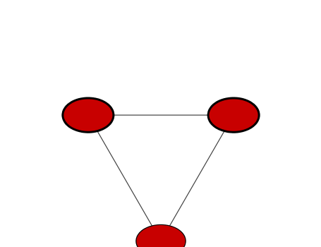
```


```r
setVisualStyle(cwd, "Marquee")
```

```
## network visual style has been set to "Marquee"
```


```r
saveImage(cwd,
          file.name="demo_marquee",
          image.type="png",
          h=350)

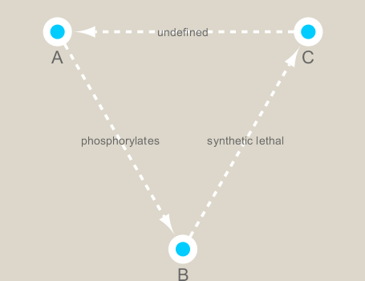
```


```r
styles <- getVisualStyleNames(cwd)
styles
```

```
##  [1] "BioPAX_SIF"           "Marquee"              "Solid"               
##  [4] "size_rank"            "Curved"               "Ripple"              
##  [7] "default black"        "Sample1"              "Big Labels"          
## [10] "Universe"             "Sample2"              "default"             
## [13] "Nested Network Style" "Gradient1"            "Minimal"             
## [16] "Directed"             "Sample3"              "BioPAX"
```


```r
## scripts for processing located in "inst/data-raw/"
prok_vir_cor <- read.delim("virus_prok_cor_abundant.tsv", stringsAsFactors = FALSE)

## Have a peak at the first 6 rows
head(prok_vir_cor)
```

```
##       Var1          Var2    weight
## 1  ph_1061 AACY020068177 0.8555342
## 2  ph_1258 AACY020207233 0.8055750
## 3  ph_3164 AACY020207233 0.8122517
## 4  ph_1033 AACY020255495 0.8487498
## 5 ph_10996 AACY020255495 0.8734617
## 6 ph_11038 AACY020255495 0.8740782
```

```r
g <- graph.data.frame(prok_vir_cor, directed = FALSE)
```


```r
class(g)
```

```
## [1] "igraph"
```


```r
g
```

```
## IGRAPH 239c304 UNW- 845 1544 -- 
## + attr: name (v/c), weight (e/n)
## + edges from 239c304 (vertex names):
##  [1] ph_1061 --AACY020068177 ph_1258 --AACY020207233
##  [3] ph_3164 --AACY020207233 ph_1033 --AACY020255495
##  [5] ph_10996--AACY020255495 ph_11038--AACY020255495
##  [7] ph_11040--AACY020255495 ph_11048--AACY020255495
##  [9] ph_11096--AACY020255495 ph_1113 --AACY020255495
## [11] ph_1208 --AACY020255495 ph_13207--AACY020255495
## [13] ph_1346 --AACY020255495 ph_14679--AACY020255495
## [15] ph_1572 --AACY020255495 ph_16045--AACY020255495
## + ... omitted several edges
```

```r
plot(g)
```

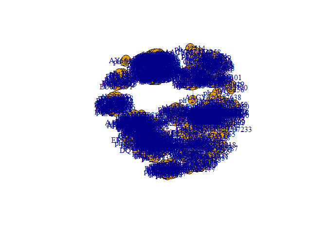<!-- -->

```r
plot(g, vertex.label=NA)
```

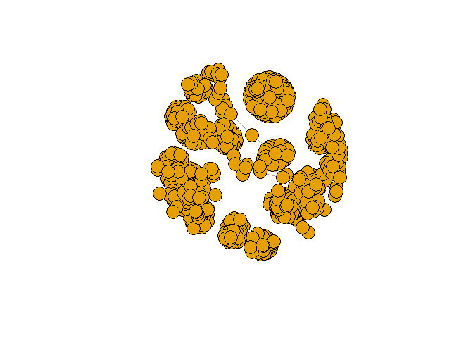<!-- -->


```r
plot(g, vertex.size=3, vertex.label=NA)
```

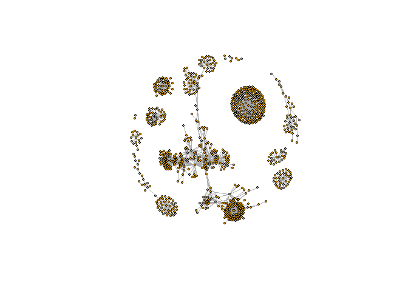<!-- -->


```r
#install.packages("ggragph")
```

```r
V(g)
```

```
## + 845/845 vertices, named, from 239c304:
##   [1] ph_1061       ph_1258       ph_3164       ph_1033       ph_10996     
##   [6] ph_11038      ph_11040      ph_11048      ph_11096      ph_1113      
##  [11] ph_1208       ph_13207      ph_1346       ph_14679      ph_1572      
##  [16] ph_16045      ph_1909       ph_1918       ph_19894      ph_2117      
##  [21] ph_2231       ph_2363       ph_276        ph_2775       ph_2798      
##  [26] ph_3217       ph_3336       ph_3493       ph_3541       ph_3892      
##  [31] ph_4194       ph_4602       ph_4678       ph_484        ph_4993      
##  [36] ph_4999       ph_5001       ph_5010       ph_5286       ph_5287      
##  [41] ph_5302       ph_5321       ph_5643       ph_6441       ph_654       
##  [46] ph_6954       ph_7389       ph_7920       ph_8039       ph_8695      
## + ... omitted several vertices
```

```r
E(g)
```

```
## + 1544/1544 edges from 239c304 (vertex names):
##  [1] ph_1061 --AACY020068177 ph_1258 --AACY020207233
##  [3] ph_3164 --AACY020207233 ph_1033 --AACY020255495
##  [5] ph_10996--AACY020255495 ph_11038--AACY020255495
##  [7] ph_11040--AACY020255495 ph_11048--AACY020255495
##  [9] ph_11096--AACY020255495 ph_1113 --AACY020255495
## [11] ph_1208 --AACY020255495 ph_13207--AACY020255495
## [13] ph_1346 --AACY020255495 ph_14679--AACY020255495
## [15] ph_1572 --AACY020255495 ph_16045--AACY020255495
## [17] ph_1909 --AACY020255495 ph_1918 --AACY020255495
## [19] ph_19894--AACY020255495 ph_2117 --AACY020255495
## + ... omitted several edges
```


```r
cb <- cluster_edge_betweenness(g)
```

```
## Warning in cluster_edge_betweenness(g): At community.c:460 :Membership
## vector will be selected based on the lowest modularity score.
```

```
## Warning in cluster_edge_betweenness(g): At community.c:467 :Modularity
## calculation with weighted edge betweenness community detection might not
## make sense -- modularity treats edge weights as similarities while edge
## betwenness treats them as distances
```

```r
cb
```

```
## IGRAPH clustering edge betweenness, groups: 18, mod: 0.82
## + groups:
##   $`1`
##   [1] "ph_1061"       "AACY020068177"
##   
##   $`2`
##    [1] "ph_1258"       "ph_5861"       "ph_7172"       "ph_11569"     
##    [5] "ph_1291"       "ph_1600"       "ph_2702"       "ph_5790"      
##    [9] "ph_5858"       "ph_7594"       "ph_7816"       "ph_784"       
##   [13] "ph_1359"       "ph_1534"       "ph_1874"       "ph_2465"      
##   [17] "ph_5453"       "ph_900"        "ph_908"        "ph_811"       
##   [21] "ph_1367"       "ph_1452"       "ph_1458"       "ph_1723"      
##   + ... omitted several groups/vertices
```


```r
plot(cb, y=g, vertex.label=NA,  vertex.size=3)
```

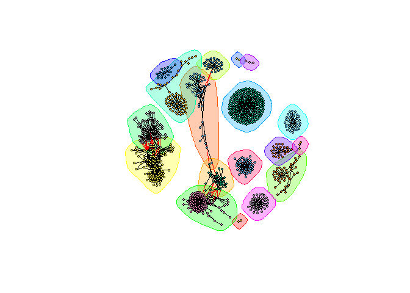<!-- -->
You can extract a cluster/community membership vector for further inspection with the membership() function:


```r
head( membership(cb) )
```

```
##  ph_1061  ph_1258  ph_3164  ph_1033 ph_10996 ph_11038 
##        1        2        3        4        4        4
```

The degree of a node or vertex is its most basic structural property, the number of its adjacent edges. Here we calculate and plot the node degree distribution.


```r
# Calculate and plot node degree of our network
d <- degree(g)
hist(d, breaks=30, col="lightblue", main ="Node Degree Distribution")
```

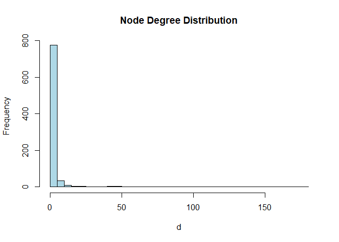<!-- -->
For the degree_distribution() function a numeric vector of the same length as the maximum degree plus one is returned. The first element is the relative frequency zero degree vertices, the second vertices with degree one, etc.

```r
plot( degree_distribution(g), type="h" )
```

<!-- -->
Centrality gives an estimation on how important a node or edge is for the connectivity (or the information flow) of a network. It is a particularly useful parameter in signaling networks and it is often used when trying to find drug targets for example.

Centrality analysis often aims to answer the following question: Which nodes are the most important and why?

One centrality method that you can often find in publications is the Google PageRank score. For the explanation of the PageRank algorithm, see the following webpage: http://infolab.stanford.edu/~backrub/google.html

```r
pr <- page_rank(g)
head(pr$vector)
```

```
##      ph_1061      ph_1258      ph_3164      ph_1033     ph_10996 
## 0.0011834320 0.0011599483 0.0019042088 0.0005788564 0.0005769663 
##     ph_11038 
## 0.0005745460
```

Lets plot our network with nodes size scaled via this page rank centrality scores.


```r
#install.packages("BBmisc")
```


```r
# Make a size vector btwn 2 and 20 for node plotting size
v.size <- BBmisc::normalize(pr$vector, range=c(2,20), method="range")
plot(g, vertex.size=v.size, vertex.label=NA)
```

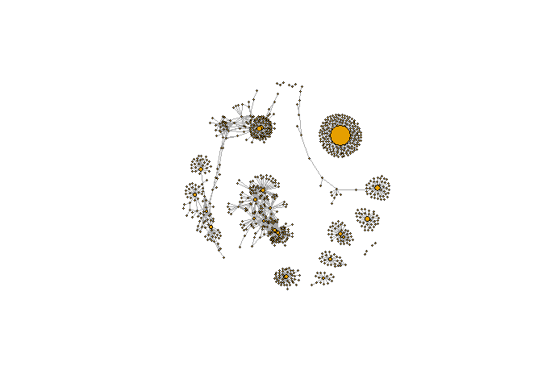<!-- -->
One of the simplest centrality scores is of course degree that we calculated previously and stored as the object d. Lets plot this one out also

```r
v.size <- BBmisc::normalize(d, range=c(2,20), method="range")
plot(g, vertex.size=v.size, vertex.label=NA)
```

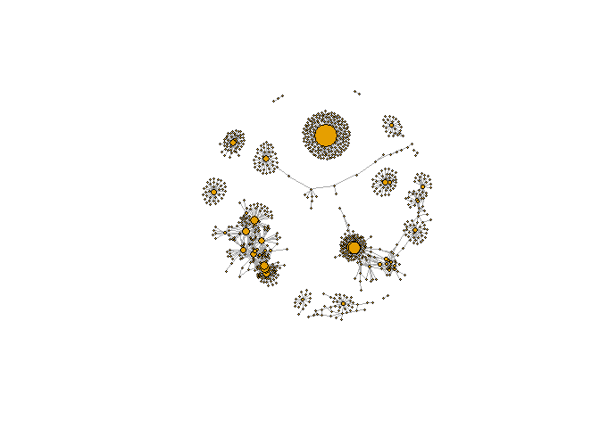<!-- -->

Another very common centrality score is betweenness. The vertex and edge betweenness are (roughly) defined by the number of geodesics (shortest paths) going through a vertex or an edge.


```r
b <- betweenness(g)
v.size <- BBmisc::normalize(b, range=c(2,20), method="range")
plot(g, vertex.size=v.size, vertex.label=NA)
```

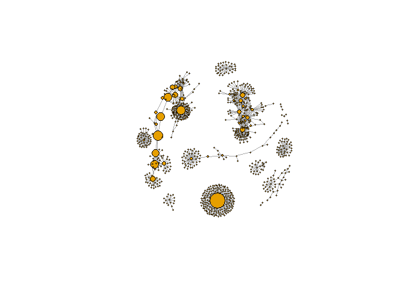<!-- -->
Since these are data from small, microscopic organisms that were sequenced using shotgun sequencing, we rely on the classification of the sequences to know what kind of organisms are in the samples. In this case the bacterial viruses (bacteriophage), were classified by Basic Local Alignment Search Tool (BLAST http://blast.ncbi.nlm.nih.gov/Blast.cgi) by searching for their closest sequence in the RefSeq database (see methods in Brum et al. (2015)). The prokaryotic taxonomic classifications were determined using the SILVA database.


```r
phage_id_affiliation <- read.delim("phage_ids_with_affiliation.tsv")
head(phage_id_affiliation)
```

```
##   first_sheet.Phage_id first_sheet.Phage_id_network phage_affiliation
## 1        109DCM_115804                       ph_775              <NA>
## 2        109DCM_115804                       ph_775              <NA>
## 3        109DCM_115804                       ph_775              <NA>
## 4        109DCM_115804                       ph_775              <NA>
## 5        109DCM_115804                       ph_775              <NA>
## 6        109DCM_115804                       ph_775              <NA>
##   Domain DNA_or_RNA Tax_order Tax_subfamily Tax_family Tax_genus
## 1   <NA>       <NA>      <NA>          <NA>       <NA>      <NA>
## 2   <NA>       <NA>      <NA>          <NA>       <NA>      <NA>
## 3   <NA>       <NA>      <NA>          <NA>       <NA>      <NA>
## 4   <NA>       <NA>      <NA>          <NA>       <NA>      <NA>
## 5   <NA>       <NA>      <NA>          <NA>       <NA>      <NA>
## 6   <NA>       <NA>      <NA>          <NA>       <NA>      <NA>
##   Tax_species
## 1        <NA>
## 2        <NA>
## 3        <NA>
## 4        <NA>
## 5        <NA>
## 6        <NA>
```


```r
bac_id_affi <- read.delim("prok_tax_from_silva.tsv", stringsAsFactors = FALSE)
head(bac_id_affi)
```

```
##    Accession_ID  Kingdom         Phylum          Class             Order
## 1 AACY020068177 Bacteria    Chloroflexi   SAR202 clade marine metagenome
## 2 AACY020125842  Archaea  Euryarchaeota Thermoplasmata Thermoplasmatales
## 3 AACY020187844  Archaea  Euryarchaeota Thermoplasmata Thermoplasmatales
## 4 AACY020105546 Bacteria Actinobacteria Actinobacteria             PeM15
## 5 AACY020281370  Archaea  Euryarchaeota Thermoplasmata Thermoplasmatales
## 6 AACY020147130  Archaea  Euryarchaeota Thermoplasmata Thermoplasmatales
##              Family             Genus Species
## 1              <NA>              <NA>    <NA>
## 2   Marine Group II marine metagenome    <NA>
## 3   Marine Group II marine metagenome    <NA>
## 4 marine metagenome              <NA>    <NA>
## 5   Marine Group II marine metagenome    <NA>
## 6   Marine Group II marine metagenome    <NA>
```
In preparation for sending the networks to Cytoscape we will add in the taxonomic data.

```r
## Extract out our vertex names
genenet.nodes <- as.data.frame(vertex.attributes(g), stringsAsFactors=FALSE)
head(genenet.nodes)
```

```
##       name
## 1  ph_1061
## 2  ph_1258
## 3  ph_3164
## 4  ph_1033
## 5 ph_10996
## 6 ph_11038
```
How may phage (i.e. ph_) entries do we have?

J

```r
length( grep("^ph_",genenet.nodes[,1]) )
```

```
## [1] 764
```
Therefore we have 81 non phage nodes.

Now lets merge() these with the annotation data

```r
# We dont need all annotation data so lets make a reduced table 'z' for merging
z <- bac_id_affi[,c("Accession_ID", "Kingdom", "Phylum", "Class")]
n <- merge(genenet.nodes, z, by.x="name", by.y="Accession_ID", all.x=TRUE)
head(n)
```

```
##            name  Kingdom          Phylum               Class
## 1 AACY020068177 Bacteria     Chloroflexi        SAR202 clade
## 2 AACY020207233 Bacteria Deferribacteres     Deferribacteres
## 3 AACY020255495 Bacteria  Proteobacteria Gammaproteobacteria
## 4 AACY020288370 Bacteria  Actinobacteria      Acidimicrobiia
## 5 AACY020396101 Bacteria  Actinobacteria      Acidimicrobiia
## 6 AACY020398456 Bacteria  Proteobacteria Gammaproteobacteria
```

```r
# Check on the column names before deciding what to merge
colnames(n)
```

```
## [1] "name"    "Kingdom" "Phylum"  "Class"
```


```r
colnames(phage_id_affiliation)
```

```
##  [1] "first_sheet.Phage_id"         "first_sheet.Phage_id_network"
##  [3] "phage_affiliation"            "Domain"                      
##  [5] "DNA_or_RNA"                   "Tax_order"                   
##  [7] "Tax_subfamily"                "Tax_family"                  
##  [9] "Tax_genus"                    "Tax_species"
```


```r
# Again we only need a subset of `phage_id_affiliation` for our purposes
y <- phage_id_affiliation[, c("first_sheet.Phage_id_network", "phage_affiliation","Tax_order", "Tax_subfamily")]

# Add the little phage annotation that we have
x <- merge(x=n, y=y, by.x="name", by.y="first_sheet.Phage_id_network", all.x=TRUE)

## Remove duplicates from multiple matches
x <- x[!duplicated( (x$name) ),]
head(x)
```

```
##            name  Kingdom          Phylum               Class
## 1 AACY020068177 Bacteria     Chloroflexi        SAR202 clade
## 2 AACY020207233 Bacteria Deferribacteres     Deferribacteres
## 3 AACY020255495 Bacteria  Proteobacteria Gammaproteobacteria
## 4 AACY020288370 Bacteria  Actinobacteria      Acidimicrobiia
## 5 AACY020396101 Bacteria  Actinobacteria      Acidimicrobiia
## 6 AACY020398456 Bacteria  Proteobacteria Gammaproteobacteria
##   phage_affiliation Tax_order Tax_subfamily
## 1              <NA>      <NA>          <NA>
## 2              <NA>      <NA>          <NA>
## 3              <NA>      <NA>          <NA>
## 4              <NA>      <NA>          <NA>
## 5              <NA>      <NA>          <NA>
## 6              <NA>      <NA>          <NA>
```
Save our merged annotation results back to genenet.nodes.

```r
genenet.nodes <- x
```

Add to the network the data related to the connections between the organisms, the edge data, and then prepare to send the nodes and edges to Cytoscape using the function cyPlot().


```r
genenet.edges <- data.frame(igraph::as_edgelist(g))
names(genenet.edges) <- c("name.1",
                          "name.2")
genenet.edges$Weight <- igraph::edge_attr(g)[[1]]

genenet.edges$name.1 <- as.character(genenet.edges$name.1)
genenet.edges$name.2 <- as.character(genenet.edges$name.2)
genenet.nodes$name <- as.character(genenet.nodes$name)

ug <- cyPlot(genenet.nodes,genenet.edges)
```

Now we will send the network from R to Cytoscape.

To begin we create a connection in R that we can use to manipulate the networks and then we will delete any windows that were already in Cytoscape so that we don’t use up all of our memory.

```r
# Open a new connection and delete any existing windows/networks in Cy
cy <- CytoscapeConnection()
deleteAllWindows(cy)
```

If you tun back to your Cytoscape window you should now see that all previous networks have been removed from the open display.


```r
cw <- CytoscapeWindow("Tara oceans",
                      graph = ug,
                      overwriteWindow = TRUE)
```
If you tun back to your Cytoscape window you should now see a new Network window listed as “Tara oceans”. However, as of yet there will be no network graph displayed as we have not called the displayGraph() function to Cytoscape yet.


```r
displayGraph(cw)
```

```
## [1] "Kingdom"
## [1] "Phylum"
## [1] "Class"
## [1] "phage_affiliation"
## [1] "Tax_order"
## [1] "Tax_subfamily"
## [1] "label"
## [1] "Weight"
```

```r
layoutNetwork(cw)
fitContent(cw)
```

We would like to get an overview of the different phylum of bacteria that are in the network. One way is to color the different nodes based on their phylum classification. The package Rcolorbrewer will be used to generate a set of good colors for the nodes.


```r
families_to_colour <- unique(genenet.nodes$Phylum)
families_to_colour <- families_to_colour[!is.na(families_to_colour)]

node.colour <- RColorBrewer::brewer.pal(length(families_to_colour), "Set3")
```

Color things up


```r
setNodeColorRule(cw,
                 "Phylum",
                 families_to_colour,
                 node.colour,
                 "lookup",
                 default.color = "#ffffff")
```

```
## Successfully set rule.
```
And take a pic

```r
saveImage(cw,
          file.name="net2",
          image.type="png",
          h=350)
library(knitr)
```

```r
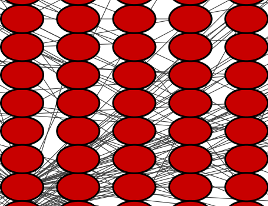
```


Set node shape to reflect virus or prokaryote
Next we would like to change the shape of the node to reflect whether the nodes are viral or prokaryotic in origin. In this dataset all of the viral node names start with “ph_”, thus we can set the viral nodes to be diamond-shaped by looking for all the nodes that start with “ph” in the network.

```r
shapes_for_nodes <- c("DIAMOND")

phage_names <- grep("ph_",
                    genenet.nodes$name,
                    value = TRUE)
setNodeShapeRule(cw,
                 "label",
                 phage_names,
                 shapes_for_nodes)
```

```
## Successfully set rule.
```

```r
displayGraph(cw)
```

```
## [1] "Kingdom"
## [1] "Phylum"
## [1] "Class"
## [1] "phage_affiliation"
## [1] "Tax_order"
## [1] "Tax_subfamily"
## [1] "label"
## [1] "Weight"
```

```r
fitContent(cw)
```

The classification of the viral data was done in a very conservative manner so not many of the viral nodes were identified. However, if we do want to add some of this information to our visualization we can color the edges of the viral nodes by family. The main families that were identified in this dataset are the Podoviridae, the Siphoviridae and the Myoviridae (for more info see NCBI Podoviridae, NCBI Myoviridae, and NCBI Siphoviridae)


```r
setDefaultNodeBorderWidth(cw, 5)
families_to_colour <- c("Podoviridae",
                        "Siphoviridae",
                        "Myoviridae")

node.colour <- RColorBrewer::brewer.pal(length(families_to_colour),
                          "Dark2")
setNodeBorderColorRule(cw,
                       "Tax_subfamily",
                       families_to_colour,
                       node.colour,
                       "lookup", 
                       default.color = "#000000")
```

```
## Successfully set rule.
```


```r
displayGraph(cw)
```

```
## [1] "Kingdom"
## [1] "Phylum"
## [1] "Class"
## [1] "phage_affiliation"
## [1] "Tax_order"
## [1] "Tax_subfamily"
## [1] "label"
## [1] "Weight"
```

```r
fitContent(cw)
saveImage(cw,
          "co-occur2",
          "png",
          h=350)
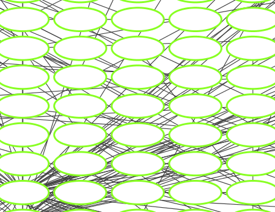
```


Use a network layout to minimize the overlap of nodes.
After doing all of this coloring to the network we would like to layout the network in a way that allows us to more easily see which nodes are connected without overlap. To do this we will change the layout.

When using RCy3 to drive Cytoscape, if we are not sure what the current values are for a layout or we are not sure what kinds of values are accepted for the different parameters of our layout, we can investigate using the RCy3 functions getLayoutPropertyNames() and then getLayoutPropertyValue().


```r
getLayoutNames(cw)
```

```
##  [1] "attribute-circle"      "stacked-node-layout"  
##  [3] "degree-circle"         "circular"             
##  [5] "attributes-layout"     "kamada-kawai"         
##  [7] "force-directed"        "cose"                 
##  [9] "grid"                  "hierarchical"         
## [11] "fruchterman-rheingold" "isom"                 
## [13] "force-directed-cl"
```


```r
getLayoutPropertyNames(cw, layout.name="force-directed")
```

```
## [1] "numIterations"            "defaultSpringCoefficient"
## [3] "defaultSpringLength"      "defaultNodeMass"         
## [5] "isDeterministic"          "singlePartition"
```


```r
getLayoutPropertyValue(cw, "force-directed", "defaultSpringLength") 
```

```
## [1] 50
```


```r
getLayoutPropertyValue(cw, "force-directed", "numIterations")  
```

```
## [1] 100
```

Once we decide on the properties we want, we can go ahead and set fine-grained properties of a given layout like this:

```r
#setLayoutProperties(cw,
#                    layout.name = force-directed",
#                    list(defaultSpringLength = 20,
#                         "numIterations" = 200))
#layoutNetwork(cw,
#              layout.name = "force-directed")
#fitContent(cw)
```

For now let’s just use the default force-directed layout.

```r
layoutNetwork(cw, layout.name = "force-directed")
fitContent(cw)
```

Look at network properties
One thing that might be interesting to visualize is nodes that are connected to many different nodes and nodes that are connected to few other nodes. The number of other nodes to which one node is connected is called degree. We can use a gradient of size to quickly visualize nodes that have high degree.

```r
## initiate a new node attribute
ug2 <- initNodeAttribute(graph = ug,
                          "degree",
                          "numeric",
                          0.0) 

## Use the igraph to calculate degree from the original graph
nodeData(ug2, nodes(ug2), "degree") <- igraph::degree(g)

cw2 <- CytoscapeWindow("Tara oceans with degree",
                      graph = ug2,
                      overwriteWindow = TRUE)
displayGraph(cw2)
```

```
## [1] "Kingdom"
## [1] "Phylum"
## [1] "Class"
## [1] "phage_affiliation"
## [1] "Tax_order"
## [1] "Tax_subfamily"
## [1] "degree"
## [1] "label"
## [1] "Weight"
```

```r
layoutNetwork(cw2)
```

Size by degree

```r
degree_control_points <- c(min(igraph::degree(g)),
                           mean(igraph::degree(g)),
                           max(igraph::degree(g)))
node_sizes <- c(20,
                20,
                80,
                100,
                110) # number of control points in interpolation mode,
                     # the first and the last are for sizes "below" and "above" the attribute seen.

setNodeSizeRule(cw2,
                "degree",
                degree_control_points,
                node_sizes,
                mode = "interpolate")
```

```
## Locked node dimensions successfully even if the check box is not ticked.
## Locked node dimensions successfully even if the check box is not ticked.
## Successfully set rule.
```


```r
layoutNetwork(cw2,
              "force-directed")
```

