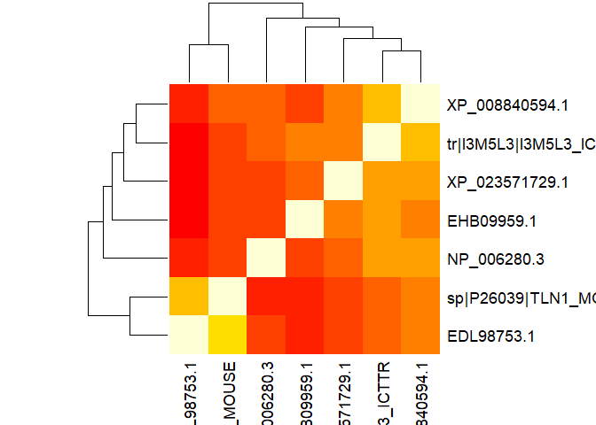
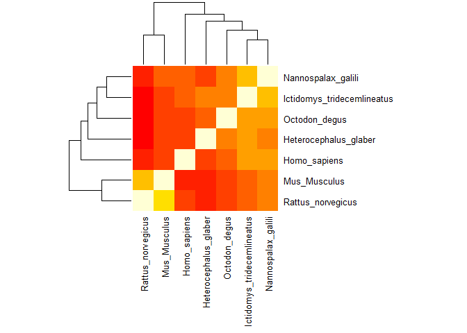
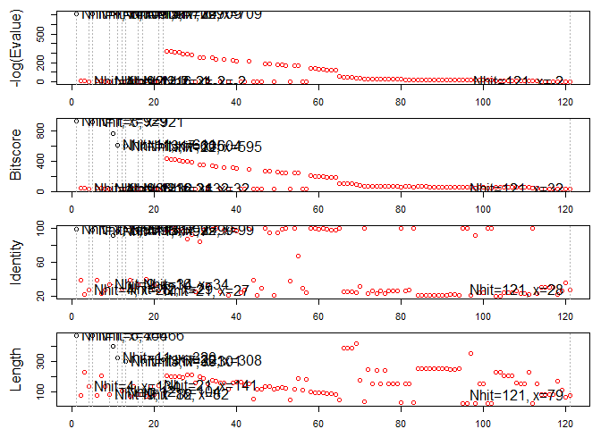

#Question 7


```r
library(bio3d)
```


```r
degus <- read.fasta("data/talin1degus.fasta")
homosapian <- read.fasta("data/talin1homosapian.fasta")
mouse <- read.fasta("data/talin1mouse.fasta.txt")
nakedmolerat <- read.fasta("data/talin1nakedmolerat.fasta")
novelrat <- read.fasta("data/talin1novelrat.fasta")
spalax <- read.fasta("data/talin1spalax.fasta")
squirrel <- read.fasta("data/talin1squirrel.fasta.txt")
```


```r
combinedfastas <- seqbind(novelrat,homosapian,degus,nakedmolerat,mouse,spalax , squirrel)
```


```r
alignedseqs <- seqaln(aln = combinedfastas$ali, exefile = "muscle.exe", outfile = "alignedfile.fa", protein = TRUE)
```


```r
try2 <- read.fasta("alignedfile.fa")
```


```r
dim(try2$ali)
```

```
## [1]    7 2559
```


```r
try2score <- seqidentity(try2$ali)
```


```r
heatmap(try2score)
```

<!-- -->


```r
colnames(try2score) <- c("Rattus_norvegicus","Mus_Musculus", "Homo_sapiens", "Heterocephalus_glaber", "Nannospalax_galili", "Ictidomys_tridecemlineatus", "Octodon_degus")

#colnames(try2score)

rownames(try2score) <- c("Rattus_norvegicus","Mus_Musculus", "Homo_sapiens", "Heterocephalus_glaber", "Nannospalax_galili", "Ictidomys_tridecemlineatus", "Octodon_degus")
```


```r
heatmap(try2score, margins = c(11,11), cexRow = 1, cexCol = 1)
```

<!-- -->


```r
par("mar")
```

```
## [1] 5.1 4.1 4.1 2.1
```


```r
consensusseq <- consensus(try2$ali)
```


```r
blastedseq <- blast.pdb(consensusseq$seq)
```

```
##  Searching ... please wait (updates every 5 seconds) RID = HE4T6ZZZ014 
##  .
##  Reporting 121 hits
```


```r
hits <- plot.blast(blastedseq)
```

```
##   * Possible cutoff values:    709 1 709 -3 709 -1 709 -2 709 -3 709 -3 
##             Yielding Nhits:    1 4 5 9 11 12 13 16 17 21 22 121 
## 
##   * Chosen cutoff value of:    1 
##             Yielding Nhits:    101
```

<!-- -->

```r
head(hits$pdb.id)
```

```
## [1] "5IC0_A" "5IC0_A" "5IC0_A" "5IC0_A" "5IC1_A" "5IC1_A"
```


```r
annotatedhits <- pdb.annotate(hits$pdb.id)
```

```
## Warning in pdb.annotate(hits$pdb.id): ids should be standard 4 character
## PDB-IDs: trying first 4 characters...
```


```r
##doitforthecombining <- blastedseq$hit.tbl
#combinedhits <- cbind(doitforthecombining,annotatedhits)
```

```r
fastathing <- consensusseq$seq

fastathingtest <- as.fasta(fastathing)

aliplz <- fastathingtest$ali
```

